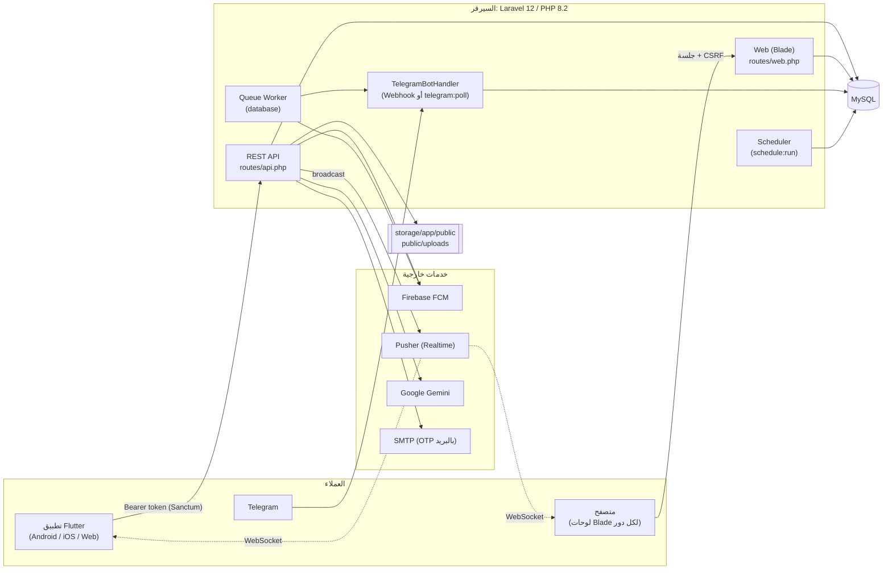

# المعمارية

## المخطط العام

## البنية الطبقية (Backend)

| الطبقة | المكان | الدور |
|---|---|---|
| المسارات | `routes/api.php`, `routes/web.php`, `routes/channels.php`, `routes/console.php` | تعريف الواجهات، وربط الـ middleware (دور، جلسة واحدة، throttle) |
| Middleware | `app/Http/Middleware/` | `RoleMiddleware` (API)، `Check*Role` (ويب)، `EnsureSingleApiSession`، `EnsureSingleWebSession` |
| Controllers | `app/Http/Controllers/{Api,Web,WebHead}` | منطق الطلبات. **ضخمة** وتمزج المنطق مع العرض (انظر القسم 5 من حالة المشروع) |
| Services | `app/Services/` | `FcmService`، `TelegramService`، `TelegramBotHandler`، `AbsenceWarningService`، `StudentAcademicService`، خدمات PDF/Excel/صور الجداول |
| Observers | `app/Observers/` | `AttendanceObserver` (إنذارات الغياب + إشعار Telegram)، `GradeObserver` (إشعار العلامات) |
| Support | `app/Support/` | `SingleSessionGuard`، `LoginThrottleGuard` |
| Traits | `app/Traits/` | `FaceRecognitionTrait`، `HandlesMessagesTrait`، `NormalizesAccountCredentialsTrait` |
| Jobs/Events | `app/Jobs`, `app/Events` | إرسال FCM/Telegram في الخلفية، بث الرسائل (`MessageSent`) |
| Models | `app/Models/` | 42 نموذجاً Eloquent بمفاتيح أساسية مخصصة |
| Commands | `app/Console/Commands/` | أوامر الصيانة والتوليد (انظر أدناه) |

## واجهتان لنفس المنطق

| | API (للتطبيق) | الويب (Blade) |
|---|---|---|
| المصادقة | Sanctum Bearer token | جلسة Laravel + CSRF |
| الحماية بالدور | `role:student` … | `student` / `teacher` / `hod` / `affairs` / `admin` / `parent` |
| الجلسة الواحدة | توكن واحد حالي (`current_token_id`) | `current_session_id` + نافذة خمول 20 دقيقة |
| الدخول | `POST /api/login` | صفحة لكل دور: `/student/login`, `/teacher/login`, `/hod/login`, `/affairs/login`, `/admin/login`, `/parent/login` (تدار بـ `UnifiedAuthController`) |

> المنطق الأساسي مكرر بين الواجهتين (مثلاً تسجيل الحضور بالـ QR له نسخة في API ونسخة في Web ونسخة في Telegram). هذا أكبر دَين تقني في المشروع.

## الوقت الحقيقي والإشعارات

- **الدردشة:** حدث `MessageSent` يُبث عبر Pusher على قناة خاصة `chat.{user_id}`، والتطبيق يستمع إليها، **وبالتوازي polling كل ثانيتين** كخط احتياطي.
- **الإشعارات:** تُخزَّن في جدول `notifications`، ويرسل `FcmService` دفعاً (HTTP v1 بحساب خدمة)، ويقرأها التطبيق بـ polling كل 30 ثانية، وللطالب إشعار Telegram.
- **التوثيق على القنوات:** `POST /api/broadcasting/auth`.

## المهام المجدولة والأوامر

| الأمر | الجدولة | الوظيفة |
|---|---|---|
| `attendance:daily-summary` | يومياً 22:00 | ملخص حضور اليوم لكل مربّي دورة |
| `logs:clean --days=90` | يومياً | تنظيف سجل النشاط القديم |
| (مهمة مجدولة داخل `bootstrap/app.php`) | كل 5 دقائق | حذف الرسائل المؤقتة المنتهية ومرفقاتها |
| `telegram:poll` | يدوي/خدمة | تشغيل البوت بالـ polling بديلاً عن الـ webhook |
| `schedules:generate [--fresh]` | يدوي | توليد جداول ودوامات وامتحانات بيانات تجريبية |
| `grades:generate [--fresh]` | يدوي | توليد علامات تجريبية |
| `db:export` | يدوي | تصدير قاعدة البيانات |

يتطلب ذلك **Cron** يشغّل `php artisan schedule:run` كل دقيقة، و**عامل طوابير** `php artisan queue:work`.

## تطبيق Flutter

| الجانب | التفصيل |
|---|---|
| نقطة الدخول | `lib/main.dart`: يحمّل الإعدادات (ثيم، خط، لغة)، ويهيّئ `ApiService` وFirebase في الخلفية، ثم `_AppRouter` يقرأ `token` و`role` من `SharedPreferences` ويوجّه لشاشة الدور |
| إدارة الحالة | `provider` (`ChatService`) + `ValueNotifier` للإعدادات + `SharedPreferences` |
| الشبكة | `dio` عبر `ApiService` (+ `SingleSessionInterceptor` لمعالجة `LOGGED_IN_ELSEWHERE`)، وطبقات خدمات: `student_services`, `admin_services`, `affairs_services`, `parent_services` |
| الهيكل | `lib/screens/<role>/` (admin, Affairs_Officer, Head of department, parents, student, teacher, shared, auth, onboarding)، و`lib/widgets/` لمكونات مشتركة |
| الوجه | `google_mlkit_face_detection` لاكتشاف الوجه + `tflite_flutter` بنموذج `mobile_face_net.tflite` (112×112 ← 192 بُعداً) |
| الاتصال بالخادم | اكتشاف تلقائي: USB (`127.0.0.1` عبر ADB reverse) ثم قائمة عناوين LAN معروفة ثم مسح الشبكة الفرعية |
| لغات | عربي/إنجليزي، وضع داكن، 3 أحجام خط، ولون أساسي يتحكم به الأدمن (`/api/system/settings`) |

## ملاحظات بيئة التشغيل الحالية

- الإعداد الحالي موجَّه **للتشغيل المحلي على لابتوب**: `php artisan serve` (منفذ 8000 أو 8001)، ونفق USB، وبوابة `ngrok` (استُبعد `ngrok.exe` من المستودع).
- لا يوجد Docker ولا CI/CD ولا خادم ويب إنتاجي مُعدّ. التفاصيل في [`06-setup-and-deploy.md`](06-setup-and-deploy.md).
