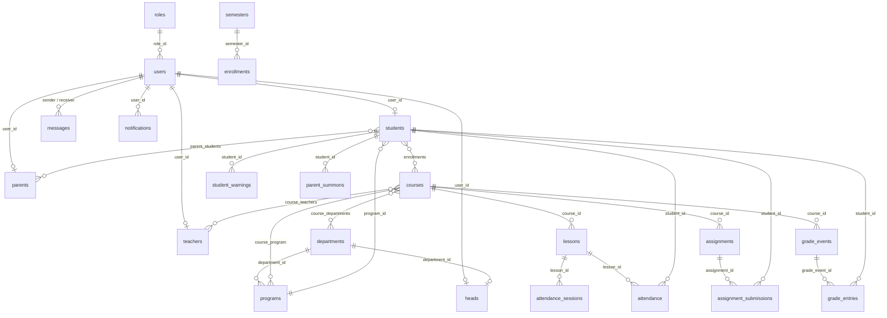

# قاموس قاعدة البيانات

> مُولَّد آلياً من الـ migrations الفعلية (تشغيل `php artisan migrate` على قاعدة فارغة ثم قراءة `information_schema`). **62 جدولاً و3 Views، 579 عموداً، 72 مفتاحاً أجنبياً.**

## ملاحظات مهمة قبل القراءة

- **المفاتيح الأساسية مخصصة وليست `id`** في أغلب الجداول: `user_id` و`student_id` و`teacher_id` و`course_id` و`lesson_id`... (استثناءات: `programs.id` و`grade_events.id` و`attendance_sessions.id`).
- **العلاقات المنطقية أكثر من المفاتيح الأجنبية المعلنة** (72 مفتاحاً فقط). كثير من الربط يتم في الكود دون قيد في القاعدة، مثل `parent_students` و`leave_requests.student_id`.
- **تنبيه تناسق:** `parent_students.parent_id/student_id` و`leave_requests.student_id` قد تحمل `users.user_id` أو المعرّف الداخلي (`parents.parent_id` / `students.student_id`). الكود يتعامل مع الاثنين (انظر `08-project-status.md`، البند B-04).
- جداول بنية قديمة ما زالت موجودة: `chats`, `user_activity`, `session`, `otps`, `subjects`، ولا يبدو أنها مستخدمة (يلزم تحقق قبل حذفها).

## المخطط العلاقاتي للجداول الأساسية

يعرض أهم الجداول والعلاقات (مفاتيح أجنبية معلنة + علاقات منطقية موثَّقة من الـ models). المخطط بصيغة Mermaid ويُرسم تلقائياً في GitHub وموقع التوثيق.

## فهرس الجداول

| الجدول | النوع | الوصف |
|---|---|---|
| [`absence_requests`](#absence_requests) | جدول | طلبات إذن الغياب |
| [`admin_generated_reports`](#admin_generated_reports) | جدول | سجل التقارير التي أنشأتها الإدارة |
| [`admin_profile_stats_view`](#admin_profile_stats_view) | View | View: إحصاءات ملف الأدمن |
| [`admins`](#admins) | جدول | ملف الإدارة |
| [`affairs_dashboard_stats_view`](#affairs_dashboard_stats_view) | View | View: إحصاءات لوحة الشؤون |
| [`announcements`](#announcements) | جدول | الإعلانات والأنشطة (جمهور مستهدف، صور، رابط، تفاصيل فعالية) |
| [`assignment_submissions`](#assignment_submissions) | جدول | تسليمات الطلاب والتصحيح |
| [`assignments`](#assignments) | جدول | الواجبات |
| [`attendance`](#attendance) | جدول | سجل الحضور: الحالة، الجهاز، الموقع، درجة مطابقة الوجه، سبب الرفض، العذر |
| [`attendance_sessions`](#attendance_sessions) | جدول | جلسة حضور: رمز QR المتجدد، الموقع ونصف القطر، الصلاحية |
| [`cache`](#cache) | جدول | كاش Laravel |
| [`cache_locks`](#cache_locks) | جدول | أقفال الكاش |
| [`calendar_events`](#calendar_events) | جدول | أحداث التقويم الأكاديمي |
| [`chats`](#chats) | جدول | جدول دردشة قديم |
| [`course_program`](#course_program) | جدول | ربط المقررات بالبرامج |
| [`course_teachers`](#course_teachers) | جدول | تدريس المعلّمين للمقررات، مع الدور (مثل advisor) |
| [`courses`](#courses) | جدول | المقررات (الاسم، الكود، الساعات، الوزن، السنة، الفصل) |
| [`departments`](#departments) | جدول | الأقسام الأكاديمية، وسياسة مزامنة الحضور بدون إنترنت (offline_sync_policy) |
| [`enrollments`](#enrollments) | جدول | تسجيل الطلاب في المقررات حسب الفصل |
| [`exams`](#exams) | جدول | جدول الامتحانات |
| [`failed_jobs`](#failed_jobs) | جدول | المهام الفاشلة |
| [`grade_entries`](#grade_entries) | جدول | علامات الطلاب في كل حدث تقييم |
| [`grade_events`](#grade_events) | جدول | أحداث التقييم (امتحان/مذاكرة/شفهي) بتاريخها ووقتها وعلامتها العظمى |
| [`grade_report_requests`](#grade_report_requests) | جدول | طلبات رئيس القسم لتقارير العلامات من المعلّمين |
| [`grades`](#grades) | جدول | علامات الامتحانات (النظام القديم) |
| [`group_user`](#group_user) | جدول | أعضاء المجموعات |
| [`groups`](#groups) | جدول | مجموعات الدردشة |
| [`head_schedule_entries`](#head_schedule_entries) | جدول | مدخلات الجدول التي ينشئها رئيس القسم |
| [`heads`](#heads) | جدول | رؤساء الأقسام وربطهم بالقسم |
| [`job_batches`](#job_batches) | جدول | دفعات المهام |
| [`jobs`](#jobs) | جدول | طابور المهام |
| [`leave_requests`](#leave_requests) | جدول | طلبات الإجازة (الطالب ← ولي الأمر ← رئيس القسم ← الشؤون) |
| [`lessons`](#lessons) | جدول | المحاضرات/الجلسات (ملف، فيديو، معلّم، مقرر)، وتُنشأ جلسة حضور لكل محاضرة |
| [`messages`](#messages) | جدول | رسائل الدردشة (مرفقات، رد، تحويل، حذف، رسائل مؤقتة، تسليم/قراءة) |
| [`migrations`](#migrations) | جدول | — |
| [`notifications`](#notifications) | جدول | الإشعارات داخل النظام (النوع، التصنيف، المعرّف المرتبط) |
| [`otp_codes`](#otp_codes) | جدول | رموز التحقق عبر البريد (الحالية) |
| [`otps`](#otps) | جدول | رموز تحقق (بنية قديمة) |
| [`parent_meeting_requests`](#parent_meeting_requests) | جدول | طلبات مواعيد من أولياء الأمور |
| [`parent_students`](#parent_students) | جدول | ربط أولياء الأمور بالطلاب (علاقة كثير لكثير) |
| [`parent_summons`](#parent_summons) | جدول | استدعاءات أولياء الأمور (يدوية أو تلقائية بعد 10 أيام غياب) |
| [`parents`](#parents) | جدول | ملف ولي الأمر |
| [`performance_reports`](#performance_reports) | جدول | تقارير الأداء |
| [`personal_access_tokens`](#personal_access_tokens) | جدول | توكنات Sanctum |
| [`photo_change_requests`](#photo_change_requests) | جدول | طلبات تغيير صورة الطالب المرجعية |
| [`programs`](#programs) | جدول | البرامج/الاختصاصات التابعة للأقسام |
| [`quiz_options`](#quiz_options) | جدول | خيارات أسئلة المذاكرات |
| [`quiz_questions`](#quiz_questions) | جدول | أسئلة المذاكرات |
| [`quizzes`](#quizzes) | جدول | المذاكرات الإلكترونية |
| [`report_requests`](#report_requests) | جدول | طلبات تقارير سلوكية (من رئيس القسم أو ولي الأمر) وملاحظات الرئيس |
| [`resources`](#resources) | جدول | ملفات ومراجع المقرر |
| [`roles`](#roles) | جدول | تعريف الأدوار الستة |
| [`schedules`](#schedules) | جدول | الجدول الدراسي الأسبوعي (اليوم، الوقت، القاعة، الشعبة) |
| [`semesters`](#semesters) | جدول | الفصول الدراسية وتفعيل الفصل الحالي |
| [`session`](#session) | جدول | جدول جلسات قديم |
| [`student_requests`](#student_requests) | جدول | طلبات الخدمات الطلابية (استرحام، وثائق، مذاكرة تعويضية، فك قفل جهاز) |
| [`student_warnings`](#student_warnings) | جدول | إنذارات الغياب التلقائية (الأول/الثاني/النهائي) |
| [`students`](#students) | جدول | ملف الطالب: الكود، المستوى، البرنامج، ربط الجهاز، بصمة الوجه المرجعية |
| [`system_settings`](#system_settings) | جدول | إعدادات النظام (الثيم) |
| [`teacher_dashboard_stats_view`](#teacher_dashboard_stats_view) | View | View: إحصاءات لوحة المعلّم |
| [`teachers`](#teachers) | جدول | ملف المعلّم، وحقول المربّي (advisor_branch / advisor_year) |
| [`university_ids`](#university_ids) | جدول | الأرقام الجامعية المسبقة التي تُنشئها الشؤون قبل تسجيل الطالب |
| [`user_activities`](#user_activities) | جدول | سجل نشاط المستخدمين (تدقيق) |
| [`user_activity`](#user_activity) | جدول | سجل نشاط قديم |
| [`users`](#users) | جدول | الحسابات الأساسية لكل الأدوار (الدخول، الدور، الحالة، الجلسة، قفل الحساب، توكن FCM، معرّف تيليغرام) |

---

## absence_requests

طلبات إذن الغياب

| العمود | النوع | Null | افتراضي | مفتاح | ملاحظات |
|---|---|---|---|---|---|
| `request_id` | `bigint(20) unsigned` | لا |  | PK | auto-increment |
| `student_id` | `bigint(20) unsigned` | لا |  | INDEX |  |
| `date` | `date` | لا |  |  |  |
| `reason` | `text` | لا |  |  |  |
| `document` | `varchar(255)` | نعم | NULL |  |  |
| `status` | `varchar(50)` | لا | 'pending_parent' |  |  |
| `reviewed_by` | `bigint(20) unsigned` | نعم | NULL | INDEX |  |
| `created_at` | `timestamp` | نعم | NULL |  |  |
| `updated_at` | `timestamp` | نعم | NULL |  |  |

**مفاتيح أجنبية:** `student_id` ← `students.student_id`، `reviewed_by` ← `users.user_id`

## admin_generated_reports

سجل التقارير التي أنشأتها الإدارة

| العمود | النوع | Null | افتراضي | مفتاح | ملاحظات |
|---|---|---|---|---|---|
| `id` | `bigint(20) unsigned` | لا |  | PK | auto-increment |
| `title` | `varchar(255)` | لا |  |  |  |
| `report_type` | `varchar(255)` | لا |  |  |  |
| `department_id` | `bigint(20) unsigned` | نعم | NULL |  |  |
| `department_name` | `varchar(255)` | نعم | NULL |  |  |
| `program_id` | `bigint(20) unsigned` | نعم | NULL |  |  |
| `program_name` | `varchar(255)` | نعم | NULL |  |  |
| `semester_id` | `bigint(20) unsigned` | نعم | NULL |  |  |
| `semester_name` | `varchar(255)` | نعم | NULL |  |  |
| `from_date` | `date` | نعم | NULL |  |  |
| `to_date` | `date` | نعم | NULL |  |  |
| `created_at` | `timestamp` | نعم | NULL |  |  |
| `updated_at` | `timestamp` | نعم | NULL |  |  |

## admin_profile_stats_view

View: إحصاءات ملف الأدمن

| العمود | النوع | Null | افتراضي | مفتاح | ملاحظات |
|---|---|---|---|---|---|
| `total_users` | `bigint(21)` | نعم | NULL |  |  |
| `total_courses` | `bigint(21)` | نعم | NULL |  |  |

## admins

ملف الإدارة

| العمود | النوع | Null | افتراضي | مفتاح | ملاحظات |
|---|---|---|---|---|---|
| `admin_id` | `bigint(20) unsigned` | لا |  | PK | auto-increment |
| `user_id` | `bigint(20) unsigned` | لا |  | INDEX |  |
| `created_at` | `timestamp` | نعم | NULL |  |  |
| `updated_at` | `timestamp` | نعم | NULL |  |  |

**مفاتيح أجنبية:** `user_id` ← `users.user_id`

## affairs_dashboard_stats_view

View: إحصاءات لوحة الشؤون

| العمود | النوع | Null | افتراضي | مفتاح | ملاحظات |
|---|---|---|---|---|---|
| `total_students` | `bigint(21)` | نعم | NULL |  |  |
| `total_teachers` | `bigint(21)` | نعم | NULL |  |  |
| `total_staff` | `bigint(21)` | نعم | NULL |  |  |
| `pending_leaves` | `bigint(21)` | نعم | NULL |  |  |
| `total_users` | `bigint(21)` | نعم | NULL |  |  |

## announcements

الإعلانات والأنشطة (جمهور مستهدف، صور، رابط، تفاصيل فعالية)

| العمود | النوع | Null | افتراضي | مفتاح | ملاحظات |
|---|---|---|---|---|---|
| `announcement_id` | `bigint(20) unsigned` | لا |  | PK | auto-increment |
| `user_id` | `bigint(20) unsigned` | لا |  | INDEX |  |
| `title` | `varchar(255)` | لا |  |  |  |
| `content` | `text` | لا |  |  |  |
| `image_path` | `varchar(255)` | نعم | NULL |  |  |
| `category` | `varchar(255)` | نعم | 'general' |  |  |
| `image` | `varchar(255)` | نعم | NULL |  |  |
| `images` | `longtext` | نعم | NULL |  |  |
| `link_url` | `varchar(255)` | نعم | NULL |  |  |
| `type` | `enum('general','course_specific')` | لا | 'general' |  |  |
| `target_audience` | `varchar(255)` | لا | 'all' | INDEX |  |
| `target_role` | `varchar(255)` | نعم | NULL |  |  |
| `department_id` | `bigint(20) unsigned` | نعم | NULL | INDEX |  |
| `academic_year` | `varchar(255)` | نعم | NULL |  |  |
| `course_id` | `bigint(20) unsigned` | نعم | NULL | INDEX |  |
| `created_at` | `timestamp` | نعم | NULL | INDEX |  |
| `updated_at` | `timestamp` | نعم | NULL |  |  |
| `event_date` | `date` | نعم | NULL |  |  |
| `event_time` | `time` | نعم | NULL |  |  |
| `location` | `varchar(255)` | نعم | NULL |  |  |

**مفاتيح أجنبية:** `course_id` ← `courses.course_id`، `user_id` ← `users.user_id`

## assignment_submissions

تسليمات الطلاب والتصحيح

| العمود | النوع | Null | افتراضي | مفتاح | ملاحظات |
|---|---|---|---|---|---|
| `submission_id` | `bigint(20) unsigned` | لا |  | PK | auto-increment |
| `assignment_id` | `bigint(20) unsigned` | لا |  | INDEX |  |
| `student_id` | `bigint(20) unsigned` | لا |  | INDEX |  |
| `file_path` | `varchar(255)` | نعم | NULL |  |  |
| `solution_text` | `text` | نعم | NULL |  |  |
| `student_notes` | `text` | نعم | NULL |  |  |
| `grade` | `decimal(5,2)` | نعم | NULL |  |  |
| `feedback` | `text` | نعم | NULL |  |  |
| `submitted_at` | `datetime` | لا |  |  |  |
| `created_at` | `timestamp` | نعم | NULL |  |  |
| `updated_at` | `timestamp` | نعم | NULL |  |  |

**مفاتيح أجنبية:** `student_id` ← `students.student_id`، `assignment_id` ← `assignments.assignment_id`

## assignments

الواجبات

| العمود | النوع | Null | افتراضي | مفتاح | ملاحظات |
|---|---|---|---|---|---|
| `assignment_id` | `bigint(20) unsigned` | لا |  | PK | auto-increment |
| `course_id` | `bigint(20) unsigned` | لا |  | INDEX |  |
| `teacher_id` | `bigint(20) unsigned` | نعم | NULL | INDEX |  |
| `title` | `varchar(255)` | لا |  |  |  |
| `description` | `text` | نعم | NULL |  |  |
| `notes` | `text` | نعم | NULL |  |  |
| `file_path` | `varchar(255)` | نعم | NULL |  |  |
| `file_name` | `varchar(255)` | نعم | NULL |  |  |
| `file_type` | `varchar(255)` | نعم | NULL |  |  |
| `due_date` | `datetime` | لا |  |  |  |
| `max_points` | `int(11)` | لا | 100 |  |  |
| `attachment_path` | `varchar(255)` | نعم | NULL |  |  |
| `created_at` | `timestamp` | نعم | NULL |  |  |
| `updated_at` | `timestamp` | نعم | NULL |  |  |

**مفاتيح أجنبية:** `teacher_id` ← `teachers.teacher_id`، `course_id` ← `courses.course_id`

## attendance

سجل الحضور: الحالة، الجهاز، الموقع، درجة مطابقة الوجه، سبب الرفض، العذر

| العمود | النوع | Null | افتراضي | مفتاح | ملاحظات |
|---|---|---|---|---|---|
| `attendance_id` | `bigint(20) unsigned` | لا |  | PK | auto-increment |
| `student_id` | `bigint(20) unsigned` | لا |  | INDEX |  |
| `lesson_id` | `bigint(20) unsigned` | لا |  | INDEX |  |
| `status` | `enum('present','absent','late')` | لا |  |  |  |
| `device_id` | `varchar(255)` | نعم | NULL |  | معرّف الجهاز الذي سجّل الحضور |
| `latitude` | `decimal(10,7)` | نعم | NULL |  | خط عرض موقع الطالب لحظة المسح |
| `longitude` | `decimal(10,7)` | نعم | NULL |  | خط طول موقع الطالب لحظة المسح |
| `reject_reason` | `enum('expired_qr','device_mismatch','location_too_far','already_marked','session_closed','face_mismatch')` | نعم | NULL |  |  |
| `face_image` | `mediumtext` | نعم | NULL |  |  |
| `face_score` | `double` | نعم | NULL |  |  |
| `face_status` | `enum('first_time','verified','suspicious','rejected')` | نعم | NULL |  |  |
| `attendance_date` | `date` | لا |  |  |  |
| `excuse_text` | `text` | نعم | NULL |  |  |
| `excuse_attachment` | `varchar(255)` | نعم | NULL |  |  |
| `excuse_status` | `enum('none','pending','approved','rejected')` | لا | 'none' |  |  |
| `created_at` | `timestamp` | نعم | NULL |  |  |
| `updated_at` | `timestamp` | نعم | NULL |  |  |

**مفاتيح أجنبية:** `lesson_id` ← `lessons.lesson_id`، `student_id` ← `students.student_id`

## attendance_sessions

جلسة حضور: رمز QR المتجدد، الموقع ونصف القطر، الصلاحية

| العمود | النوع | Null | افتراضي | مفتاح | ملاحظات |
|---|---|---|---|---|---|
| `id` | `bigint(20) unsigned` | لا |  | PK | auto-increment |
| `lesson_id` | `bigint(20) unsigned` | لا |  | INDEX |  |
| `qr_token` | `varchar(255)` | لا |  | UNIQUE |  |
| `expires_at` | `timestamp` | لا | current_timestamp() |  |  |
| `session_expires_at` | `timestamp` | نعم | NULL |  |  |
| `is_active` | `tinyint(1)` | لا | 1 |  |  |
| `closed_at` | `timestamp` | نعم | NULL |  | وقت إغلاق الجلسة من المعلم |
| `latitude` | `decimal(10,7)` | نعم | NULL |  | خط عرض موقع المعلم عند فتح الجلسة |
| `longitude` | `decimal(10,7)` | نعم | NULL |  | خط طول موقع المعلم عند فتح الجلسة |
| `radius_meters` | `smallint(5) unsigned` | لا | 50 |  | الحد الأقصى للمسافة المسموح بها بالمتر (افتراضي 50م) |
| `created_at` | `timestamp` | نعم | NULL |  |  |
| `updated_at` | `timestamp` | نعم | NULL |  |  |

**مفاتيح أجنبية:** `lesson_id` ← `lessons.lesson_id`

## cache

كاش Laravel

| العمود | النوع | Null | افتراضي | مفتاح | ملاحظات |
|---|---|---|---|---|---|
| `key` | `varchar(255)` | لا |  | PK |  |
| `value` | `mediumtext` | لا |  |  |  |
| `expiration` | `int(11)` | لا |  | INDEX |  |

## cache_locks

أقفال الكاش

| العمود | النوع | Null | افتراضي | مفتاح | ملاحظات |
|---|---|---|---|---|---|
| `key` | `varchar(255)` | لا |  | PK |  |
| `owner` | `varchar(255)` | لا |  |  |  |
| `expiration` | `int(11)` | لا |  | INDEX |  |

## calendar_events

أحداث التقويم الأكاديمي

| العمود | النوع | Null | افتراضي | مفتاح | ملاحظات |
|---|---|---|---|---|---|
| `id` | `bigint(20) unsigned` | لا |  | PK | auto-increment |
| `user_id` | `bigint(20) unsigned` | لا |  | INDEX |  |
| `title` | `varchar(255)` | لا |  |  |  |
| `event_date` | `date` | لا |  |  |  |
| `event_time` | `time` | نعم | NULL |  |  |
| `location` | `varchar(255)` | نعم | NULL |  |  |
| `department_id` | `bigint(20) unsigned` | نعم | NULL | INDEX |  |
| `created_at` | `timestamp` | نعم | NULL |  |  |
| `updated_at` | `timestamp` | نعم | NULL |  |  |

**مفاتيح أجنبية:** `user_id` ← `users.user_id`، `department_id` ← `departments.department_id`

## chats

جدول دردشة قديم

| العمود | النوع | Null | افتراضي | مفتاح | ملاحظات |
|---|---|---|---|---|---|
| `chat_id` | `bigint(20) unsigned` | لا |  | PK | auto-increment |
| `sender_id` | `bigint(20) unsigned` | لا |  | INDEX |  |
| `receiver_id` | `bigint(20) unsigned` | لا |  | INDEX |  |
| `content` | `text` | لا |  |  |  |
| `sent_at` | `timestamp` | لا | current_timestamp() |  |  |
| `created_at` | `timestamp` | نعم | NULL |  |  |
| `updated_at` | `timestamp` | نعم | NULL |  |  |

**مفاتيح أجنبية:** `sender_id` ← `users.user_id`، `receiver_id` ← `users.user_id`

## course_program

ربط المقررات بالبرامج

| العمود | النوع | Null | افتراضي | مفتاح | ملاحظات |
|---|---|---|---|---|---|
| `id` | `bigint(20) unsigned` | لا |  | PK | auto-increment |
| `course_id` | `bigint(20) unsigned` | لا |  | INDEX |  |
| `program_id` | `bigint(20) unsigned` | لا |  | INDEX |  |
| `created_at` | `timestamp` | نعم | NULL |  |  |
| `updated_at` | `timestamp` | نعم | NULL |  |  |

**مفاتيح أجنبية:** `program_id` ← `programs.id`، `course_id` ← `courses.course_id`

## course_teachers

تدريس المعلّمين للمقررات، مع الدور (مثل advisor)

| العمود | النوع | Null | افتراضي | مفتاح | ملاحظات |
|---|---|---|---|---|---|
| `course_teacher_id` | `bigint(20) unsigned` | لا |  | PK | auto-increment |
| `course_id` | `bigint(20) unsigned` | لا |  | INDEX |  |
| `teacher_id` | `bigint(20) unsigned` | لا |  | INDEX |  |
| `role` | `varchar(255)` | نعم | NULL |  |  |
| `created_at` | `timestamp` | نعم | NULL |  |  |
| `updated_at` | `timestamp` | نعم | NULL |  |  |

**مفاتيح أجنبية:** `teacher_id` ← `teachers.teacher_id`، `course_id` ← `courses.course_id`

## courses

المقررات (الاسم، الكود، الساعات، الوزن، السنة، الفصل)

| العمود | النوع | Null | افتراضي | مفتاح | ملاحظات |
|---|---|---|---|---|---|
| `course_id` | `bigint(20) unsigned` | لا |  | PK | auto-increment |
| `code` | `varchar(50)` | نعم | NULL |  | رمز المادة الدراسية |
| `title` | `varchar(255)` | لا |  |  |  |
| `weight` | `int(11)` | لا | 1 |  | تثقيل المادة (عدد الساعات) |
| `description` | `text` | نعم | NULL |  |  |
| `level` | `varchar(255)` | لا |  |  |  |
| `hours` | `int(11)` | لا | 0 |  |  |
| `year` | `tinyint(4)` | نعم | 1 |  |  |
| `semester_id` | `bigint(20) unsigned` | نعم | NULL | INDEX |  |
| `created_at` | `timestamp` | نعم | NULL |  |  |
| `updated_at` | `timestamp` | نعم | NULL |  |  |

**مفاتيح أجنبية:** `semester_id` ← `semesters.semester_id`

## departments

الأقسام الأكاديمية، وسياسة مزامنة الحضور بدون إنترنت (offline_sync_policy)

| العمود | النوع | Null | افتراضي | مفتاح | ملاحظات |
|---|---|---|---|---|---|
| `department_id` | `bigint(20) unsigned` | لا |  | PK | auto-increment |
| `name` | `varchar(255)` | لا |  |  |  |
| `description` | `text` | نعم | NULL |  |  |
| `offline_sync_policy` | `varchar(255)` | لا | 'anytime' |  |  |
| `created_at` | `timestamp` | نعم | NULL |  |  |
| `updated_at` | `timestamp` | نعم | NULL |  |  |

## enrollments

تسجيل الطلاب في المقررات حسب الفصل

| العمود | النوع | Null | افتراضي | مفتاح | ملاحظات |
|---|---|---|---|---|---|
| `enrollment_id` | `bigint(20) unsigned` | لا |  | PK | auto-increment |
| `student_id` | `bigint(20) unsigned` | لا |  | INDEX |  |
| `course_id` | `bigint(20) unsigned` | لا |  | INDEX |  |
| `enrollment_date` | `date` | لا |  |  |  |
| `status` | `varchar(255)` | لا | 'active' |  |  |
| `created_at` | `timestamp` | نعم | NULL |  |  |
| `updated_at` | `timestamp` | نعم | NULL |  |  |

**مفاتيح أجنبية:** `course_id` ← `courses.course_id`، `student_id` ← `students.student_id`

## exams

جدول الامتحانات

| العمود | النوع | Null | افتراضي | مفتاح | ملاحظات |
|---|---|---|---|---|---|
| `exam_id` | `bigint(20) unsigned` | لا |  | PK | auto-increment |
| `course_id` | `bigint(20) unsigned` | لا |  | INDEX |  |
| `exam_name` | `varchar(255)` | لا |  |  |  |
| `exam_date` | `datetime` | لا |  |  |  |
| `room` | `varchar(255)` | نعم | NULL |  |  |
| `class_group` | `varchar(255)` | نعم | NULL |  |  |
| `max_score` | `int(11)` | لا | 100 |  |  |
| `created_at` | `timestamp` | نعم | NULL |  |  |
| `updated_at` | `timestamp` | نعم | NULL |  |  |

**مفاتيح أجنبية:** `course_id` ← `courses.course_id`

## failed_jobs

المهام الفاشلة

| العمود | النوع | Null | افتراضي | مفتاح | ملاحظات |
|---|---|---|---|---|---|
| `id` | `bigint(20) unsigned` | لا |  | PK | auto-increment |
| `uuid` | `varchar(255)` | لا |  | UNIQUE |  |
| `connection` | `text` | لا |  |  |  |
| `queue` | `text` | لا |  |  |  |
| `payload` | `longtext` | لا |  |  |  |
| `exception` | `longtext` | لا |  |  |  |
| `failed_at` | `timestamp` | لا | current_timestamp() |  |  |

## grade_entries

علامات الطلاب في كل حدث تقييم

| العمود | النوع | Null | افتراضي | مفتاح | ملاحظات |
|---|---|---|---|---|---|
| `id` | `bigint(20) unsigned` | لا |  | PK | auto-increment |
| `grade_event_id` | `bigint(20) unsigned` | لا |  | INDEX |  |
| `student_id` | `bigint(20) unsigned` | لا |  | INDEX |  |
| `score` | `decimal(5,2)` | نعم | NULL |  |  |
| `notes` | `text` | نعم | NULL |  |  |
| `created_at` | `timestamp` | نعم | NULL |  |  |
| `updated_at` | `timestamp` | نعم | NULL |  |  |

**مفاتيح أجنبية:** `student_id` ← `students.student_id`، `grade_event_id` ← `grade_events.id`

## grade_events

أحداث التقييم (امتحان/مذاكرة/شفهي) بتاريخها ووقتها وعلامتها العظمى

| العمود | النوع | Null | افتراضي | مفتاح | ملاحظات |
|---|---|---|---|---|---|
| `id` | `bigint(20) unsigned` | لا |  | PK | auto-increment |
| `teacher_id` | `bigint(20) unsigned` | لا |  | INDEX |  |
| `course_id` | `bigint(20) unsigned` | نعم | NULL | INDEX |  |
| `program_id` | `bigint(20) unsigned` | نعم | NULL |  |  |
| `year_level` | `tinyint(4)` | نعم | NULL |  |  |
| `type` | `enum('exam','quiz','oral')` | لا |  | INDEX |  |
| `title` | `varchar(255)` | لا |  |  |  |
| `max_score` | `decimal(5,2)` | لا | 100.00 |  |  |
| `notes` | `text` | نعم | NULL |  |  |
| `date` | `date` | لا |  |  |  |
| `time` | `varchar(255)` | نعم | NULL |  |  |
| `duration` | `varchar(255)` | نعم | NULL |  |  |
| `created_at` | `timestamp` | نعم | NULL |  |  |
| `updated_at` | `timestamp` | نعم | NULL |  |  |

**مفاتيح أجنبية:** `teacher_id` ← `teachers.teacher_id`، `course_id` ← `courses.course_id`

## grade_report_requests

طلبات رئيس القسم لتقارير العلامات من المعلّمين

| العمود | النوع | Null | افتراضي | مفتاح | ملاحظات |
|---|---|---|---|---|---|
| `id` | `bigint(20) unsigned` | لا |  | PK | auto-increment |
| `boss_user_id` | `bigint(20) unsigned` | لا |  |  |  |
| `teacher_user_id` | `bigint(20) unsigned` | لا |  |  |  |
| `course_id` | `bigint(20) unsigned` | لا |  | INDEX |  |
| `status` | `varchar(255)` | لا | 'pending' |  |  |
| `notes` | `text` | نعم | NULL |  |  |
| `created_at` | `timestamp` | نعم | NULL |  |  |
| `updated_at` | `timestamp` | نعم | NULL |  |  |

**مفاتيح أجنبية:** `course_id` ← `courses.course_id`

## grades

علامات الامتحانات (النظام القديم)

| العمود | النوع | Null | افتراضي | مفتاح | ملاحظات |
|---|---|---|---|---|---|
| `grade_id` | `bigint(20) unsigned` | لا |  | PK | auto-increment |
| `student_id` | `bigint(20) unsigned` | لا |  | INDEX |  |
| `exam_id` | `bigint(20) unsigned` | لا |  | INDEX |  |
| `score` | `decimal(5,2)` | لا |  |  |  |
| `remarks` | `text` | نعم | NULL |  |  |
| `created_at` | `timestamp` | نعم | NULL |  |  |
| `updated_at` | `timestamp` | نعم | NULL |  |  |

**مفاتيح أجنبية:** `student_id` ← `students.student_id`، `exam_id` ← `exams.exam_id`

## group_user

أعضاء المجموعات

| العمود | النوع | Null | افتراضي | مفتاح | ملاحظات |
|---|---|---|---|---|---|
| `id` | `bigint(20) unsigned` | لا |  | PK | auto-increment |
| `group_id` | `bigint(20) unsigned` | لا |  | INDEX |  |
| `user_id` | `bigint(20) unsigned` | لا |  | INDEX |  |
| `created_at` | `timestamp` | نعم | NULL |  |  |
| `updated_at` | `timestamp` | نعم | NULL |  |  |

**مفاتيح أجنبية:** `user_id` ← `users.user_id`، `group_id` ← `groups.id`

## groups

مجموعات الدردشة

| العمود | النوع | Null | افتراضي | مفتاح | ملاحظات |
|---|---|---|---|---|---|
| `id` | `bigint(20) unsigned` | لا |  | PK | auto-increment |
| `name` | `varchar(255)` | لا |  |  |  |
| `image` | `varchar(255)` | نعم | NULL |  |  |
| `created_at` | `timestamp` | نعم | NULL |  |  |
| `updated_at` | `timestamp` | نعم | NULL |  |  |

## head_schedule_entries

مدخلات الجدول التي ينشئها رئيس القسم

| العمود | النوع | Null | افتراضي | مفتاح | ملاحظات |
|---|---|---|---|---|---|
| `id` | `bigint(20) unsigned` | لا |  | PK | auto-increment |
| `created_at` | `timestamp` | نعم | NULL |  |  |
| `updated_at` | `timestamp` | نعم | NULL |  |  |

## heads

رؤساء الأقسام وربطهم بالقسم

| العمود | النوع | Null | افتراضي | مفتاح | ملاحظات |
|---|---|---|---|---|---|
| `head_id` | `bigint(20) unsigned` | لا |  | PK | auto-increment |
| `user_id` | `bigint(20) unsigned` | لا |  | INDEX |  |
| `department_id` | `bigint(20) unsigned` | لا |  | INDEX |  |
| `created_at` | `timestamp` | نعم | NULL |  |  |
| `updated_at` | `timestamp` | نعم | NULL |  |  |

**مفاتيح أجنبية:** `user_id` ← `users.user_id`، `department_id` ← `departments.department_id`

## job_batches

دفعات المهام

| العمود | النوع | Null | افتراضي | مفتاح | ملاحظات |
|---|---|---|---|---|---|
| `id` | `varchar(255)` | لا |  | PK |  |
| `name` | `varchar(255)` | لا |  |  |  |
| `total_jobs` | `int(11)` | لا |  |  |  |
| `pending_jobs` | `int(11)` | لا |  |  |  |
| `failed_jobs` | `int(11)` | لا |  |  |  |
| `failed_job_ids` | `longtext` | لا |  |  |  |
| `options` | `mediumtext` | نعم | NULL |  |  |
| `cancelled_at` | `int(11)` | نعم | NULL |  |  |
| `created_at` | `int(11)` | لا |  |  |  |
| `finished_at` | `int(11)` | نعم | NULL |  |  |

## jobs

طابور المهام

| العمود | النوع | Null | افتراضي | مفتاح | ملاحظات |
|---|---|---|---|---|---|
| `id` | `bigint(20) unsigned` | لا |  | PK | auto-increment |
| `queue` | `varchar(255)` | لا |  | INDEX |  |
| `payload` | `longtext` | لا |  |  |  |
| `attempts` | `tinyint(3) unsigned` | لا |  |  |  |
| `reserved_at` | `int(10) unsigned` | نعم | NULL |  |  |
| `available_at` | `int(10) unsigned` | لا |  |  |  |
| `created_at` | `int(10) unsigned` | لا |  |  |  |

## leave_requests

طلبات الإجازة (الطالب ← ولي الأمر ← رئيس القسم ← الشؤون)

| العمود | النوع | Null | افتراضي | مفتاح | ملاحظات |
|---|---|---|---|---|---|
| `id` | `bigint(20) unsigned` | لا |  | PK | auto-increment |
| `student_id` | `bigint(20) unsigned` | نعم | NULL | INDEX |  |
| `teacher_id` | `bigint(20) unsigned` | نعم | NULL | INDEX |  |
| `type` | `enum('full_day','hourly')` | لا |  |  |  |
| `leave_category` | `enum('hourly','daily')` | لا | 'daily' |  |  |
| `date` | `date` | لا |  |  |  |
| `reason` | `text` | لا |  |  |  |
| `attachment` | `varchar(255)` | نعم | NULL |  |  |
| `status` | `varchar(50)` | لا | 'pending_parent' | INDEX |  |
| `created_at` | `timestamp` | نعم | NULL |  |  |
| `updated_at` | `timestamp` | نعم | NULL |  |  |

**مفاتيح أجنبية:** `teacher_id` ← `teachers.teacher_id`، `student_id` ← `users.user_id`

## lessons

المحاضرات/الجلسات (ملف، فيديو، معلّم، مقرر)، وتُنشأ جلسة حضور لكل محاضرة

| العمود | النوع | Null | افتراضي | مفتاح | ملاحظات |
|---|---|---|---|---|---|
| `lesson_id` | `bigint(20) unsigned` | لا |  | PK | auto-increment |
| `course_id` | `bigint(20) unsigned` | لا |  | INDEX |  |
| `title` | `varchar(255)` | لا |  |  |  |
| `description` | `text` | نعم | NULL |  |  |
| `file_path` | `varchar(255)` | نعم | NULL |  |  |
| `file_name` | `varchar(255)` | نعم | NULL |  |  |
| `file_type` | `varchar(255)` | نعم | NULL |  |  |
| `content_url` | `varchar(255)` | نعم | NULL |  |  |
| `type` | `varchar(255)` | نعم | NULL |  |  |
| `file_size` | `varchar(255)` | نعم | NULL |  |  |
| `duration` | `varchar(255)` | نعم | NULL |  |  |
| `created_at` | `timestamp` | نعم | NULL |  |  |
| `updated_at` | `timestamp` | نعم | NULL |  |  |
| `teacher_id` | `bigint(20) unsigned` | نعم | NULL | INDEX |  |
| `department_id` | `bigint(20) unsigned` | نعم | NULL | INDEX |  |

**مفاتيح أجنبية:** `teacher_id` ← `teachers.teacher_id`، `department_id` ← `departments.department_id`، `course_id` ← `courses.course_id`

## messages

رسائل الدردشة (مرفقات، رد، تحويل، حذف، رسائل مؤقتة، تسليم/قراءة)

| العمود | النوع | Null | افتراضي | مفتاح | ملاحظات |
|---|---|---|---|---|---|
| `id` | `bigint(20) unsigned` | لا |  | PK | auto-increment |
| `sender_id` | `bigint(20) unsigned` | لا |  | INDEX |  |
| `receiver_id` | `bigint(20) unsigned` | نعم | NULL | INDEX |  |
| `group_id` | `bigint(20) unsigned` | نعم | NULL |  |  |
| `course_id` | `bigint(20) unsigned` | نعم | NULL |  |  |
| `message` | `text` | نعم | NULL |  |  |
| `reply_to_message_id` | `bigint(20) unsigned` | نعم | NULL |  |  |
| `attachment` | `varchar(255)` | نعم | NULL |  |  |
| `is_read` | `tinyint(1)` | لا | 0 |  |  |
| `is_delivered` | `tinyint(1)` | لا | 0 |  |  |
| `deleted_for_sender` | `tinyint(1)` | لا | 0 |  |  |
| `deleted_for_receiver` | `tinyint(1)` | لا | 0 |  |  |
| `deleted_for_everyone` | `tinyint(1)` | لا | 0 |  |  |
| `expires_at` | `timestamp` | نعم | NULL |  |  |
| `disappears_after` | `int(11)` | نعم | NULL |  |  |
| `is_forwarded` | `tinyint(1)` | لا | 0 |  |  |
| `created_at` | `timestamp` | نعم | NULL | INDEX |  |
| `updated_at` | `timestamp` | نعم | NULL |  |  |

**مفاتيح أجنبية:** `sender_id` ← `users.user_id`، `receiver_id` ← `users.user_id`

## migrations

| العمود | النوع | Null | افتراضي | مفتاح | ملاحظات |
|---|---|---|---|---|---|
| `id` | `int(10) unsigned` | لا |  | PK | auto-increment |
| `migration` | `varchar(255)` | لا |  |  |  |
| `batch` | `int(11)` | لا |  |  |  |

## notifications

الإشعارات داخل النظام (النوع، التصنيف، المعرّف المرتبط)

| العمود | النوع | Null | افتراضي | مفتاح | ملاحظات |
|---|---|---|---|---|---|
| `id` | `bigint(20) unsigned` | لا |  | PK | auto-increment |
| `user_id` | `bigint(20) unsigned` | لا |  | INDEX |  |
| `sender_id` | `bigint(20) unsigned` | نعم | NULL | INDEX |  |
| `title` | `varchar(255)` | لا |  |  |  |
| `message` | `text` | لا |  |  |  |
| `type` | `varchar(255)` | لا |  | INDEX |  |
| `related_id` | `bigint(20) unsigned` | نعم | NULL |  |  |
| `category` | `enum('academic','administrative','chat')` | نعم | 'administrative' |  |  |
| `is_read` | `tinyint(1)` | لا | 0 | INDEX |  |
| `created_at` | `timestamp` | نعم | NULL |  |  |
| `updated_at` | `timestamp` | نعم | NULL |  |  |

**مفاتيح أجنبية:** `sender_id` ← `users.user_id`، `user_id` ← `users.user_id`

## otp_codes

رموز التحقق عبر البريد (الحالية)

| العمود | النوع | Null | افتراضي | مفتاح | ملاحظات |
|---|---|---|---|---|---|
| `id` | `bigint(20) unsigned` | لا |  | PK | auto-increment |
| `email` | `varchar(255)` | لا |  | INDEX |  |
| `code` | `varchar(6)` | لا |  |  |  |
| `expires_at` | `timestamp` | لا | current_timestamp() |  |  |
| `used` | `tinyint(1)` | لا | 0 |  |  |
| `created_at` | `timestamp` | نعم | NULL |  |  |
| `updated_at` | `timestamp` | نعم | NULL |  |  |

## otps

رموز تحقق (بنية قديمة)

| العمود | النوع | Null | افتراضي | مفتاح | ملاحظات |
|---|---|---|---|---|---|
| `id` | `bigint(20) unsigned` | لا |  | PK | auto-increment |
| `email` | `varchar(255)` | لا |  | INDEX |  |
| `token` | `varchar(255)` | لا |  |  |  |
| `expires_at` | `timestamp` | لا | current_timestamp() |  |  |
| `created_at` | `timestamp` | نعم | NULL |  |  |
| `updated_at` | `timestamp` | نعم | NULL |  |  |

## parent_meeting_requests

طلبات مواعيد من أولياء الأمور

| العمود | النوع | Null | افتراضي | مفتاح | ملاحظات |
|---|---|---|---|---|---|
| `id` | `bigint(20) unsigned` | لا |  | PK | auto-increment |
| `parent_user_id` | `bigint(20) unsigned` | لا |  | INDEX |  |
| `student_id` | `bigint(20) unsigned` | نعم | NULL | INDEX |  |
| `target_role` | `varchar(255)` | نعم | 'affairs' |  |  |
| `department_id` | `bigint(20) unsigned` | نعم | NULL |  |  |
| `target_user_id` | `bigint(20) unsigned` | نعم | NULL |  |  |
| `subject` | `varchar(255)` | لا |  |  |  |
| `reason` | `text` | لا |  |  |  |
| `preferred_date` | `date` | نعم | NULL |  |  |
| `status` | `enum('pending','approved','rejected','completed')` | لا | 'pending' |  |  |
| `admin_response` | `text` | نعم | NULL |  |  |
| `scheduled_at` | `datetime` | نعم | NULL |  |  |
| `created_at` | `timestamp` | نعم | NULL |  |  |
| `updated_at` | `timestamp` | نعم | NULL |  |  |

**مفاتيح أجنبية:** `student_id` ← `students.student_id`، `parent_user_id` ← `users.user_id`

## parent_students

ربط أولياء الأمور بالطلاب (علاقة كثير لكثير)

| العمود | النوع | Null | افتراضي | مفتاح | ملاحظات |
|---|---|---|---|---|---|
| `id` | `bigint(20) unsigned` | لا |  | PK | auto-increment |
| `parent_id` | `bigint(20) unsigned` | لا |  | INDEX |  |
| `student_id` | `bigint(20) unsigned` | لا |  | INDEX |  |
| `relationship` | `enum('father','mother','guardian')` | لا | 'father' |  |  |
| `created_at` | `timestamp` | نعم | NULL |  |  |
| `updated_at` | `timestamp` | نعم | NULL |  |  |

**مفاتيح أجنبية:** `student_id` ← `users.user_id`، `parent_id` ← `users.user_id`

## parent_summons

استدعاءات أولياء الأمور (يدوية أو تلقائية بعد 10 أيام غياب)

| العمود | النوع | Null | افتراضي | مفتاح | ملاحظات |
|---|---|---|---|---|---|
| `id` | `bigint(20) unsigned` | لا |  | PK | auto-increment |
| `sender_user_id` | `bigint(20) unsigned` | لا |  | INDEX |  |
| `student_id` | `bigint(20) unsigned` | لا |  | INDEX |  |
| `parent_user_id` | `bigint(20) unsigned` | نعم | NULL | INDEX |  |
| `subject` | `varchar(255)` | نعم | NULL |  |  |
| `reason` | `text` | نعم | NULL |  |  |
| `date` | `varchar(255)` | نعم | NULL |  |  |
| `time` | `varchar(255)` | نعم | NULL |  |  |
| `reason_title` | `varchar(255)` | لا |  |  |  |
| `details` | `text` | لا |  |  |  |
| `summon_date` | `date` | نعم | NULL |  |  |
| `status` | `enum('sent','acknowledged','attended','cancelled')` | لا | 'sent' | INDEX |  |
| `created_at` | `timestamp` | نعم | NULL |  |  |
| `updated_at` | `timestamp` | نعم | NULL |  |  |

**مفاتيح أجنبية:** `student_id` ← `students.student_id`، `sender_user_id` ← `users.user_id`

## parents

ملف ولي الأمر

| العمود | النوع | Null | افتراضي | مفتاح | ملاحظات |
|---|---|---|---|---|---|
| `parent_id` | `bigint(20) unsigned` | لا |  | PK | auto-increment |
| `user_id` | `bigint(20) unsigned` | لا |  | INDEX |  |
| `created_at` | `timestamp` | نعم | NULL |  |  |
| `updated_at` | `timestamp` | نعم | NULL |  |  |
| `telegram_id` | `varchar(255)` | نعم | NULL |  |  |

**مفاتيح أجنبية:** `user_id` ← `users.user_id`

## performance_reports

تقارير الأداء

| العمود | النوع | Null | افتراضي | مفتاح | ملاحظات |
|---|---|---|---|---|---|
| `report_id` | `bigint(20) unsigned` | لا |  | PK | auto-increment |
| `report_request_id` | `bigint(20) unsigned` | نعم | NULL |  |  |
| `student_id` | `bigint(20) unsigned` | لا |  | INDEX |  |
| `report_type` | `enum('academic','behavioral')` | لا | 'academic' |  |  |
| `attendance_rate` | `decimal(5,2)` | لا |  |  |  |
| `average_grade` | `decimal(5,2)` | لا |  |  |  |
| `recommendations` | `text` | نعم | NULL |  |  |
| `generated_at` | `timestamp` | لا | current_timestamp() |  |  |
| `created_at` | `timestamp` | نعم | NULL |  |  |
| `updated_at` | `timestamp` | نعم | NULL |  |  |

**مفاتيح أجنبية:** `student_id` ← `students.student_id`

## personal_access_tokens

توكنات Sanctum

| العمود | النوع | Null | افتراضي | مفتاح | ملاحظات |
|---|---|---|---|---|---|
| `id` | `bigint(20) unsigned` | لا |  | PK | auto-increment |
| `tokenable_type` | `varchar(255)` | لا |  | INDEX |  |
| `tokenable_id` | `bigint(20) unsigned` | لا |  |  |  |
| `name` | `text` | لا |  |  |  |
| `token` | `varchar(64)` | لا |  | UNIQUE |  |
| `abilities` | `text` | نعم | NULL |  |  |
| `last_used_at` | `timestamp` | نعم | NULL |  |  |
| `expires_at` | `timestamp` | نعم | NULL | INDEX |  |
| `created_at` | `timestamp` | نعم | NULL |  |  |
| `updated_at` | `timestamp` | نعم | NULL |  |  |

## photo_change_requests

طلبات تغيير صورة الطالب المرجعية

| العمود | النوع | Null | افتراضي | مفتاح | ملاحظات |
|---|---|---|---|---|---|
| `id` | `bigint(20) unsigned` | لا |  | PK | auto-increment |
| `user_id` | `bigint(20) unsigned` | لا |  | INDEX |  |
| `old_photo` | `varchar(255)` | نعم | NULL |  |  |
| `new_photo` | `varchar(255)` | لا |  |  |  |
| `status` | `enum('pending','approved','rejected')` | لا | 'pending' |  |  |
| `reviewed_by` | `bigint(20) unsigned` | نعم | NULL |  |  |
| `created_at` | `timestamp` | نعم | NULL |  |  |
| `updated_at` | `timestamp` | نعم | NULL |  |  |

**مفاتيح أجنبية:** `user_id` ← `users.user_id`

## programs

البرامج/الاختصاصات التابعة للأقسام

| العمود | النوع | Null | افتراضي | مفتاح | ملاحظات |
|---|---|---|---|---|---|
| `id` | `bigint(20) unsigned` | لا |  | PK | auto-increment |
| `name` | `varchar(255)` | لا |  |  |  |
| `description` | `text` | نعم | NULL |  |  |
| `year` | `varchar(255)` | نعم | NULL |  |  |
| `semester` | `varchar(255)` | نعم | NULL |  |  |
| `department_id` | `bigint(20) unsigned` | نعم | NULL | INDEX |  |
| `created_at` | `timestamp` | نعم | NULL |  |  |
| `updated_at` | `timestamp` | نعم | NULL |  |  |

**مفاتيح أجنبية:** `department_id` ← `departments.department_id`

## quiz_options

خيارات أسئلة المذاكرات

| العمود | النوع | Null | افتراضي | مفتاح | ملاحظات |
|---|---|---|---|---|---|
| `id` | `bigint(20) unsigned` | لا |  | PK | auto-increment |
| `question_id` | `bigint(20) unsigned` | لا |  | INDEX |  |
| `option_text` | `varchar(255)` | لا |  |  |  |
| `is_correct` | `tinyint(1)` | لا | 0 |  |  |
| `created_at` | `timestamp` | نعم | NULL |  |  |
| `updated_at` | `timestamp` | نعم | NULL |  |  |

**مفاتيح أجنبية:** `question_id` ← `quiz_questions.id`

## quiz_questions

أسئلة المذاكرات

| العمود | النوع | Null | افتراضي | مفتاح | ملاحظات |
|---|---|---|---|---|---|
| `id` | `bigint(20) unsigned` | لا |  | PK | auto-increment |
| `quiz_id` | `bigint(20) unsigned` | لا |  | INDEX |  |
| `question_text` | `text` | لا |  |  |  |
| `type` | `enum('mcq','text')` | لا | 'mcq' |  |  |
| `marks` | `smallint(5) unsigned` | لا | 1 |  |  |
| `order_num` | `smallint(5) unsigned` | لا | 0 |  |  |
| `created_at` | `timestamp` | نعم | NULL |  |  |
| `updated_at` | `timestamp` | نعم | NULL |  |  |

**مفاتيح أجنبية:** `quiz_id` ← `quizzes.id`

## quizzes

المذاكرات الإلكترونية

| العمود | النوع | Null | افتراضي | مفتاح | ملاحظات |
|---|---|---|---|---|---|
| `id` | `bigint(20) unsigned` | لا |  | PK | auto-increment |
| `teacher_id` | `bigint(20) unsigned` | لا |  | INDEX |  |
| `course_id` | `bigint(20) unsigned` | لا |  | INDEX |  |
| `title` | `varchar(255)` | لا |  |  |  |
| `description` | `text` | نعم | NULL |  |  |
| `duration_minutes` | `smallint(5) unsigned` | لا | 60 |  |  |
| `total_marks` | `smallint(5) unsigned` | لا | 100 |  |  |
| `start_at` | `datetime` | نعم | NULL |  |  |
| `end_at` | `datetime` | نعم | NULL |  |  |
| `is_published` | `tinyint(1)` | لا | 0 |  |  |
| `created_at` | `timestamp` | نعم | NULL |  |  |
| `updated_at` | `timestamp` | نعم | NULL |  |  |

**مفاتيح أجنبية:** `teacher_id` ← `teachers.teacher_id`، `course_id` ← `courses.course_id`

## report_requests

طلبات تقارير سلوكية (من رئيس القسم أو ولي الأمر) وملاحظات الرئيس

| العمود | النوع | Null | افتراضي | مفتاح | ملاحظات |
|---|---|---|---|---|---|
| `id` | `bigint(20) unsigned` | لا |  | PK | auto-increment |
| `head_id` | `bigint(20) unsigned` | لا |  | INDEX |  |
| `teacher_id` | `bigint(20) unsigned` | نعم | NULL | INDEX |  |
| `student_id` | `bigint(20) unsigned` | لا |  | INDEX |  |
| `course_id` | `bigint(20) unsigned` | نعم | NULL | INDEX |  |
| `year` | `tinyint(4)` | نعم | NULL |  |  |
| `report_type` | `enum('academic','behavioral')` | لا |  |  |  |
| `notes` | `text` | نعم | NULL |  |  |
| `hod_notes` | `text` | نعم | NULL |  |  |
| `status` | `enum('pending','completed')` | لا | 'pending' |  |  |
| `sent_to_parent` | `tinyint(1)` | لا | 0 |  |  |
| `created_at` | `timestamp` | نعم | NULL |  |  |
| `updated_at` | `timestamp` | نعم | NULL |  |  |

**مفاتيح أجنبية:** `teacher_id` ← `teachers.teacher_id`، `student_id` ← `students.student_id`، `head_id` ← `users.user_id`، `course_id` ← `courses.course_id`

## resources

ملفات ومراجع المقرر

| العمود | النوع | Null | افتراضي | مفتاح | ملاحظات |
|---|---|---|---|---|---|
| `resource_id` | `bigint(20) unsigned` | لا |  | PK | auto-increment |
| `course_id` | `bigint(20) unsigned` | لا |  | INDEX |  |
| `resource_name` | `varchar(255)` | لا |  |  |  |
| `file_path` | `varchar(255)` | لا |  |  |  |
| `created_at` | `timestamp` | نعم | NULL |  |  |
| `updated_at` | `timestamp` | نعم | NULL |  |  |

**مفاتيح أجنبية:** `course_id` ← `courses.course_id`

## roles

تعريف الأدوار الستة

| العمود | النوع | Null | افتراضي | مفتاح | ملاحظات |
|---|---|---|---|---|---|
| `role_id` | `bigint(20) unsigned` | لا |  | PK | auto-increment |
| `name` | `varchar(255)` | لا |  | UNIQUE |  |
| `created_at` | `timestamp` | نعم | NULL |  |  |
| `updated_at` | `timestamp` | نعم | NULL |  |  |

## schedules

الجدول الدراسي الأسبوعي (اليوم، الوقت، القاعة، الشعبة)

| العمود | النوع | Null | افتراضي | مفتاح | ملاحظات |
|---|---|---|---|---|---|
| `schedule_id` | `bigint(20) unsigned` | لا |  | PK | auto-increment |
| `course_id` | `bigint(20) unsigned` | لا |  | INDEX |  |
| `teacher_id` | `bigint(20) unsigned` | لا |  | INDEX |  |
| `class_group` | `varchar(255)` | نعم | NULL |  |  |
| `day` | `varchar(255)` | لا |  | INDEX |  |
| `start_time` | `time` | لا |  |  |  |
| `end_time` | `time` | لا |  |  |  |
| `room` | `varchar(255)` | لا |  |  |  |
| `created_at` | `timestamp` | نعم | NULL |  |  |
| `updated_at` | `timestamp` | نعم | NULL |  |  |

**مفاتيح أجنبية:** `teacher_id` ← `users.user_id`، `course_id` ← `courses.course_id`

## semesters

الفصول الدراسية وتفعيل الفصل الحالي

| العمود | النوع | Null | افتراضي | مفتاح | ملاحظات |
|---|---|---|---|---|---|
| `semester_id` | `bigint(20) unsigned` | لا |  | PK | auto-increment |
| `name` | `varchar(255)` | لا |  |  |  |
| `start_date` | `date` | لا |  |  |  |
| `end_date` | `date` | لا |  |  |  |
| `is_active` | `tinyint(1)` | لا | 0 |  |  |
| `created_at` | `timestamp` | نعم | NULL |  |  |
| `updated_at` | `timestamp` | نعم | NULL |  |  |

## session

جدول جلسات قديم

| العمود | النوع | Null | افتراضي | مفتاح | ملاحظات |
|---|---|---|---|---|---|
| `id` | `bigint(20) unsigned` | لا |  | PK | auto-increment |
| `created_at` | `timestamp` | نعم | NULL |  |  |
| `updated_at` | `timestamp` | نعم | NULL |  |  |

## student_requests

طلبات الخدمات الطلابية (استرحام، وثائق، مذاكرة تعويضية، فك قفل جهاز)

| العمود | النوع | Null | افتراضي | مفتاح | ملاحظات |
|---|---|---|---|---|---|
| `id` | `bigint(20) unsigned` | لا |  | PK | auto-increment |
| `student_id` | `bigint(20) unsigned` | لا |  | INDEX |  |
| `type` | `varchar(255)` | لا |  |  |  |
| `details` | `text` | لا |  |  |  |
| `status` | `varchar(255)` | لا | 'pending_affairs' |  |  |
| `affairs_decision` | `enum('approved','rejected')` | نعم | NULL |  |  |
| `hod_decision` | `enum('approved','rejected')` | نعم | NULL |  |  |
| `admin_decision` | `enum('approved','rejected')` | نعم | NULL |  |  |
| `affairs_notes` | `text` | نعم | NULL |  |  |
| `hod_notes` | `text` | نعم | NULL |  |  |
| `admin_notes` | `text` | نعم | NULL |  |  |
| `created_at` | `timestamp` | نعم | NULL |  |  |
| `updated_at` | `timestamp` | نعم | NULL |  |  |

**مفاتيح أجنبية:** `student_id` ← `students.student_id`

## student_warnings

إنذارات الغياب التلقائية (الأول/الثاني/النهائي)

| العمود | النوع | Null | افتراضي | مفتاح | ملاحظات |
|---|---|---|---|---|---|
| `warning_id` | `bigint(20) unsigned` | لا |  | PK | auto-increment |
| `student_id` | `bigint(20) unsigned` | لا |  | INDEX |  |
| `warning_level` | `enum('first','second','final')` | لا |  |  |  |
| `absence_days` | `int(10) unsigned` | لا |  |  |  |
| `message` | `text` | لا |  |  |  |
| `is_read` | `tinyint(1)` | لا | 0 |  |  |
| `action_data` | `longtext` | نعم | NULL |  |  |
| `created_at` | `timestamp` | نعم | NULL |  |  |
| `updated_at` | `timestamp` | نعم | NULL |  |  |

**مفاتيح أجنبية:** `student_id` ← `students.student_id`

## students

ملف الطالب: الكود، المستوى، البرنامج، ربط الجهاز، بصمة الوجه المرجعية

| العمود | النوع | Null | افتراضي | مفتاح | ملاحظات |
|---|---|---|---|---|---|
| `student_id` | `bigint(20) unsigned` | لا |  | PK | auto-increment |
| `user_id` | `bigint(20) unsigned` | لا |  | INDEX |  |
| `student_code` | `varchar(255)` | لا |  | UNIQUE |  |
| `device_id` | `varchar(255)` | نعم | NULL |  | معرّف الجهاز الوحيد المسموح له بتسجيل الحضور |
| `web_device_token` | `varchar(255)` | نعم | NULL |  | معرّف الجهاز الموثوق به للويب للتحقق من الأجهزة الجديدة ومطابقة الوجه |
| `is_device_locked` | `tinyint(1)` | لا | 0 |  | true = الجهاز مقفّل ولا يمكن تغييره إلا من الأدمن |
| `level` | `varchar(255)` | نعم | NULL |  |  |
| `face_embedding` | `longtext` | نعم | NULL |  |  |
| `reference_photo` | `varchar(255)` | نعم | NULL |  |  |
| `requires_face_reset` | `tinyint(1)` | لا | 0 |  |  |
| `birth_date` | `date` | نعم | NULL |  |  |
| `created_at` | `timestamp` | نعم | NULL |  |  |
| `updated_at` | `timestamp` | نعم | NULL |  |  |
| `program_id` | `bigint(20) unsigned` | نعم | NULL | INDEX |  |

**مفاتيح أجنبية:** `user_id` ← `users.user_id`، `program_id` ← `programs.id`

## system_settings

إعدادات النظام (الثيم)

| العمود | النوع | Null | افتراضي | مفتاح | ملاحظات |
|---|---|---|---|---|---|
| `id` | `bigint(20) unsigned` | لا |  | PK | auto-increment |
| `key` | `varchar(255)` | لا |  | UNIQUE |  |
| `value` | `text` | نعم | NULL |  |  |
| `created_at` | `timestamp` | نعم | NULL |  |  |
| `updated_at` | `timestamp` | نعم | NULL |  |  |

## teacher_dashboard_stats_view

View: إحصاءات لوحة المعلّم

| العمود | النوع | Null | افتراضي | مفتاح | ملاحظات |
|---|---|---|---|---|---|
| `teacher_id` | `bigint(20) unsigned` | لا | 0 |  |  |
| `courses_count` | `bigint(21)` | نعم | NULL |  |  |
| `active_assignments_count` | `bigint(21)` | نعم | NULL |  |  |

## teachers

ملف المعلّم، وحقول المربّي (advisor_branch / advisor_year)

| العمود | النوع | Null | افتراضي | مفتاح | ملاحظات |
|---|---|---|---|---|---|
| `teacher_id` | `bigint(20) unsigned` | لا |  | PK | auto-increment |
| `user_id` | `bigint(20) unsigned` | لا |  | INDEX |  |
| `specialization` | `varchar(255)` | لا |  |  |  |
| `created_at` | `timestamp` | نعم | NULL |  |  |
| `updated_at` | `timestamp` | نعم | NULL |  |  |
| `advisor_branch` | `varchar(255)` | نعم | NULL |  |  |
| `advisor_year` | `varchar(255)` | نعم | NULL |  |  |
| `advisor_section` | `varchar(255)` | نعم | NULL |  |  |

**مفاتيح أجنبية:** `user_id` ← `users.user_id`

## university_ids

الأرقام الجامعية المسبقة التي تُنشئها الشؤون قبل تسجيل الطالب

| العمود | النوع | Null | افتراضي | مفتاح | ملاحظات |
|---|---|---|---|---|---|
| `id` | `bigint(20) unsigned` | لا |  | PK | auto-increment |
| `university_id` | `varchar(255)` | لا |  | UNIQUE |  |
| `full_name` | `varchar(255)` | لا |  |  |  |
| `first_name` | `varchar(255)` | نعم | NULL |  |  |
| `last_name` | `varchar(255)` | نعم | NULL |  |  |
| `date_of_birth` | `date` | نعم | NULL |  |  |
| `phone` | `varchar(20)` | نعم | NULL |  |  |
| `photo` | `varchar(255)` | نعم | NULL |  |  |
| `role` | `enum('student','parent')` | لا | 'student' |  |  |
| `telegram_chat_id` | `varchar(255)` | نعم | NULL |  |  |
| `is_used` | `tinyint(1)` | لا | 0 |  |  |
| `created_by` | `bigint(20) unsigned` | نعم | NULL |  |  |
| `created_at` | `timestamp` | نعم | NULL |  |  |
| `updated_at` | `timestamp` | نعم | NULL |  |  |

## user_activities

سجل نشاط المستخدمين (تدقيق)

| العمود | النوع | Null | افتراضي | مفتاح | ملاحظات |
|---|---|---|---|---|---|
| `id` | `bigint(20) unsigned` | لا |  | PK | auto-increment |
| `user_id` | `bigint(20) unsigned` | نعم | NULL | INDEX |  |
| `user_name` | `varchar(255)` | نعم | NULL |  |  |
| `role_name` | `varchar(255)` | نعم | NULL | INDEX |  |
| `action` | `varchar(255)` | لا |  | INDEX |  |
| `description` | `text` | نعم | NULL |  |  |
| `ip_address` | `varchar(255)` | نعم | NULL |  |  |
| `user_agent` | `text` | نعم | NULL |  |  |
| `created_at` | `timestamp` | نعم | NULL |  |  |
| `updated_at` | `timestamp` | نعم | NULL |  |  |

## user_activity

سجل نشاط قديم

| العمود | النوع | Null | افتراضي | مفتاح | ملاحظات |
|---|---|---|---|---|---|
| `activity_id` | `bigint(20) unsigned` | لا |  | PK | auto-increment |
| `user_id` | `bigint(20) unsigned` | لا |  | INDEX |  |
| `activity_type` | `varchar(255)` | لا |  |  |  |
| `activity_time` | `timestamp` | لا | current_timestamp() |  |  |
| `created_at` | `timestamp` | نعم | NULL |  |  |
| `updated_at` | `timestamp` | نعم | NULL |  |  |

**مفاتيح أجنبية:** `user_id` ← `users.user_id`

## users

الحسابات الأساسية لكل الأدوار (الدخول، الدور، الحالة، الجلسة، قفل الحساب، توكن FCM، معرّف تيليغرام)

| العمود | النوع | Null | افتراضي | مفتاح | ملاحظات |
|---|---|---|---|---|---|
| `user_id` | `bigint(20) unsigned` | لا |  | PK | auto-increment |
| `role_id` | `bigint(20) unsigned` | لا |  | INDEX |  |
| `full_name` | `varchar(255)` | لا |  |  |  |
| `first_name` | `varchar(255)` | نعم | NULL |  |  |
| `last_name` | `varchar(255)` | نعم | NULL |  |  |
| `username` | `varchar(255)` | لا |  | UNIQUE |  |
| `email` | `varchar(255)` | نعم | NULL | UNIQUE |  |
| `avatar` | `varchar(255)` | نعم | NULL |  |  |
| `password` | `varchar(255)` | لا |  |  |  |
| `phone` | `varchar(255)` | نعم | NULL |  |  |
| `telegram_id` | `varchar(255)` | نعم | NULL |  |  |
| `telegram_chat_id` | `varchar(255)` | نعم | NULL |  |  |
| `university_id` | `varchar(255)` | نعم | NULL | UNIQUE |  |
| `department` | `varchar(255)` | نعم | NULL |  |  |
| `branch` | `varchar(255)` | نعم | NULL |  |  |
| `children_ids` | `longtext` | نعم | NULL |  |  |
| `gender` | `enum('ذكر','أنثى')` | نعم | NULL |  |  |
| `birth_date` | `date` | نعم | NULL |  |  |
| `academic_year` | `varchar(255)` | نعم | NULL |  |  |
| `status` | `enum('active','inactive')` | لا | 'active' | INDEX |  |
| `device_token` | `varchar(255)` | نعم | NULL |  |  |
| `notifications_muted` | `tinyint(1)` | لا | 0 |  |  |
| `last_login` | `timestamp` | نعم | NULL |  |  |
| `failed_login_attempts` | `int(10) unsigned` | لا | 0 |  |  |
| `locked_until` | `timestamp` | نعم | NULL |  |  |
| `remember_token` | `varchar(100)` | نعم | NULL |  |  |
| `current_session_id` | `varchar(255)` | نعم | NULL |  |  |
| `current_token_id` | `bigint(20) unsigned` | نعم | NULL |  |  |
| `session_last_active_at` | `timestamp` | نعم | NULL |  |  |
| `created_at` | `timestamp` | نعم | NULL |  |  |
| `updated_at` | `timestamp` | نعم | NULL |  |  |

**مفاتيح أجنبية:** `role_id` ← `roles.role_id`
