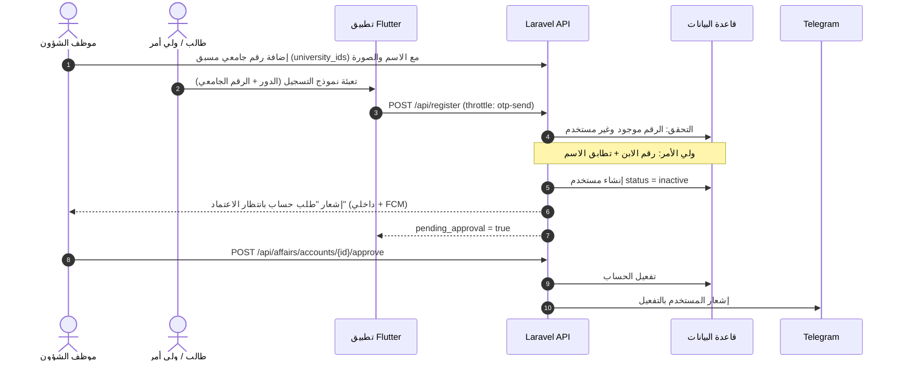
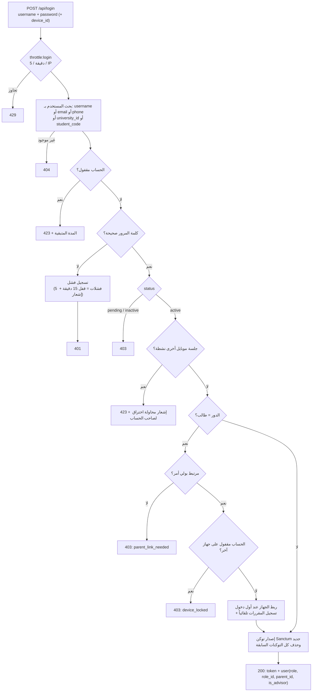
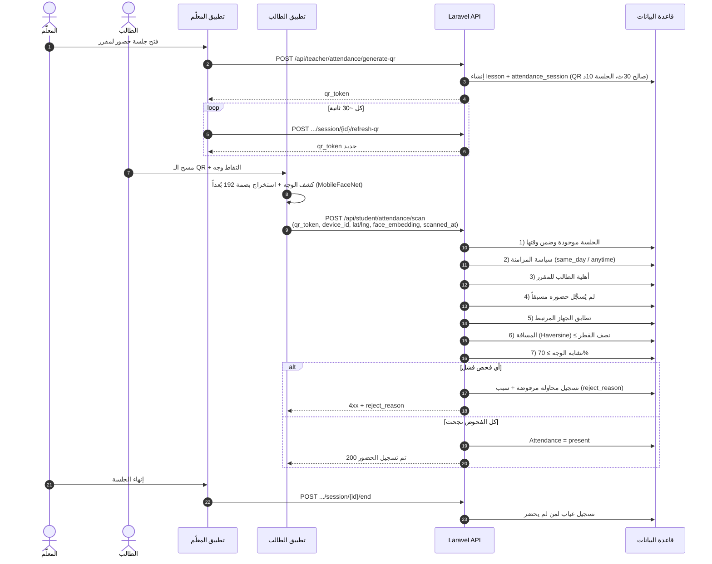
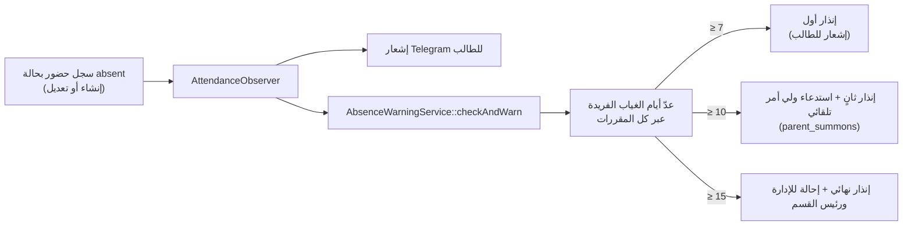
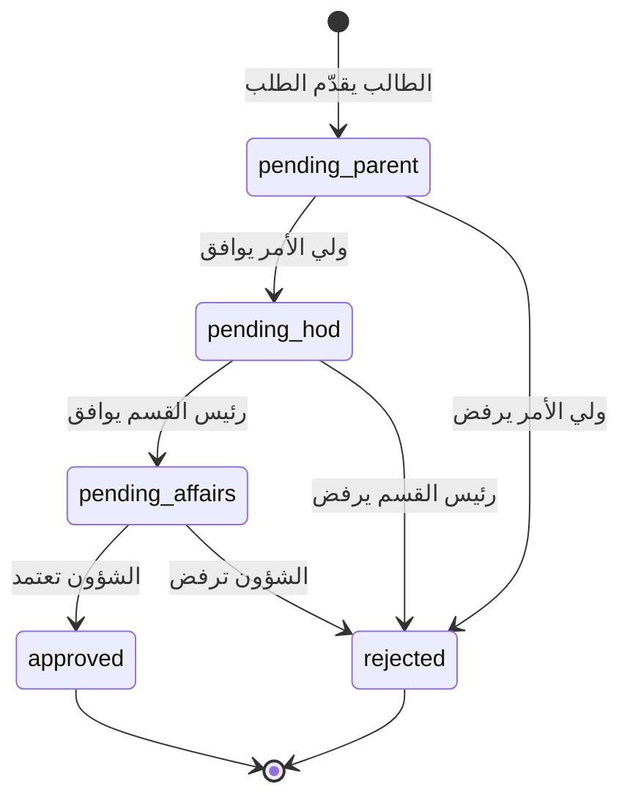
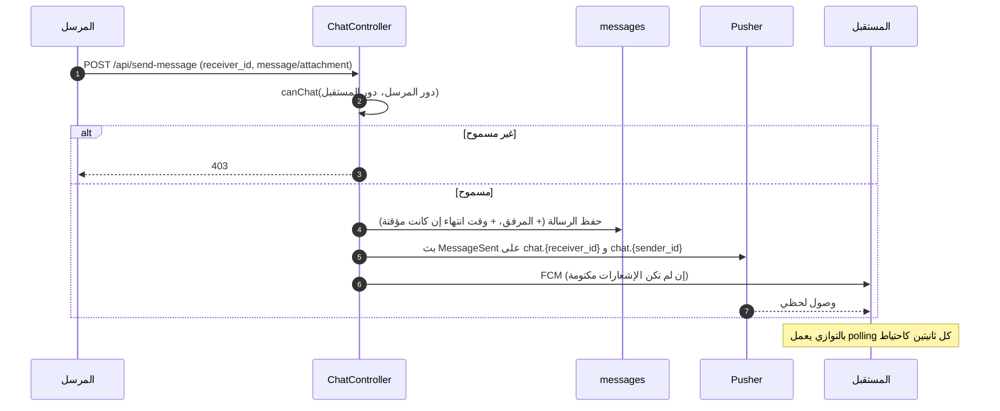
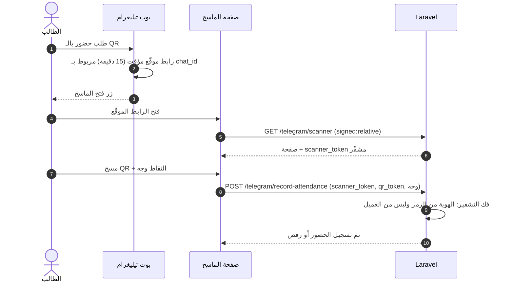

# التدفقات الرئيسية

المخططات بصيغة Mermaid (تُرسم تلقائياً في GitHub وموقع التوثيق). كل تدفق مبني على الكود الفعلي، مع ذكر الملف.

## 1) إنشاء الحساب والتفعيل

الحسابات الذاتية للطلاب وأولياء الأمور تمر بمراجعة الشؤون. (المصدر: `Api\AuthController::register`, `AffairsController::approveAccount`)

## 2) تسجيل الدخول (API)

(المصدر: `Api\AuthController::login`, `SingleSessionGuard`, `LoginThrottleGuard`)

بدائل الدخول: **OTP عبر البريد** (`/login-otp/send` ثم `/login-otp/verify`)، وللويب صفحة دخول لكل دور مع **التحقق بالوجه** للطالب عند الدخول من أجهزة متعددة.

## 3) تسجيل الحضور (QR + جهاز + موقع + وجه)

(المصدر: `Api\TeacherController::generateQrSession` و`Api\StudentController::scanAttendanceQr`)

أسباب الرفض (`reject_reason`): `expired_qr`, `sync_timeout`, `lesson_not_found`, `device_mismatch`, `location_too_far`, `face_mismatch`، بالإضافة لأسباب الأهلية وتكرار التسجيل.

## 4) الإنذارات التلقائية للغياب

(المصدر: `AttendanceObserver`, `Services\AbsenceWarningService`)

كل مستوى يُصدر **مرة واحدة** لكل طالب (`student_warnings`). انظر ملاحظة B-07 في حالة المشروع.

## 5) طلب الإجازة

(المصدر: `StudentController::requestAbsence` ← `StudentParentController::respondLeaveRequest` ← `Api\DepartmentHeadController::respondLeaveRequest` ← `AffairsController::updateLeaveStatus`)

> أسماء الحالات الدقيقة تختلف قليلاً بين `leave_requests` و`absence_requests`. راجع الجدولين في قاموس البيانات.

## 6) الدردشة

مصفوفة من يراسل من:

| المرسل | يستطيع مراسلة |
|---|---|
| الطالب | رئيس القسم، المعلّم، الإدارة |
| المعلّم | المعلّمين، الطلاب، رئيس القسم |
| ولي الأمر | الإدارة، رئيس القسم |
| رئيس القسم | ولي الأمر، المعلّم، الطالب، الإدارة |
| الإدارة | رئيس القسم، الشؤون، المعلّم، الطالب |
| الشؤون | الإدارة |

## 7) استعادة كلمة المرور

- **API:** `forgot-password` يرسل OTP، ثم `reset-password` (بالبريد + الرمز + كلمة جديدة).
- **ويب:** عبر Telegram: `send-otp` ← `verify-otp` (5 محاولات كحد أقصى) ← `reset`، والرمز محفوظ في جلسة المتصفح وصالح 15 دقيقة.

## 8) ماسح تيليغرام

(المصدر: `TelegramBotHandler::handleQrAttendanceMenu`, `TelegramWebhookController`)

الحالات: `verified` عند مطابقة وجه 70% فأكثر، `first_time` عند أول بصمة، `suspicious` عند غياب بيانات وجه أو تطابق ضعيف (مع تنبيه المعلّم). ويمكن اشتراط الوجه بـ `ATTENDANCE_REQUIRE_FACE=true`.
