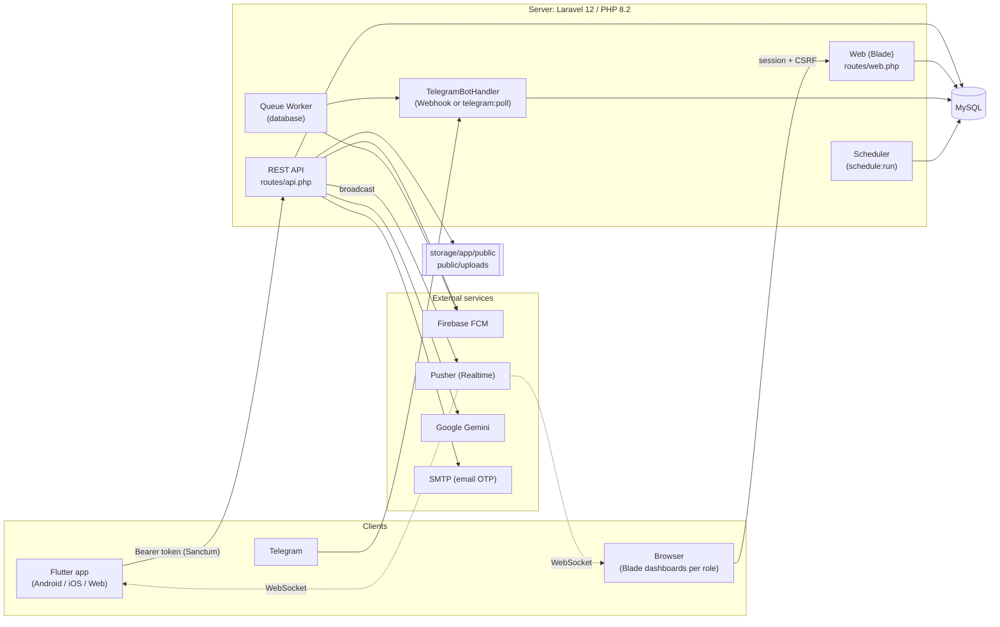

# Architecture

## Overview diagram

## Backend layers

| Layer | Location | Role |
|---|---|---|
| Routes | `routes/api.php`, `routes/web.php`, `routes/channels.php`, `routes/console.php` | Define the interfaces and attach middleware (role, single session, throttle) |
| Middleware | `app/Http/Middleware/` | `RoleMiddleware` (API), `Check*Role` (web), `EnsureSingleApiSession`, `EnsureSingleWebSession` |
| Controllers | `app/Http/Controllers/{Api,Web,WebHead}` | Request logic. **Very large** and mix business logic with presentation (see section 5 of project status) |
| Services | `app/Services/` | `FcmService`, `TelegramService`, `TelegramBotHandler`, `AbsenceWarningService`, `StudentAcademicService`, PDF/Excel/timetable-image services |
| Observers | `app/Observers/` | `AttendanceObserver` (absence warnings + Telegram notice), `GradeObserver` (grade notice) |
| Support | `app/Support/` | `SingleSessionGuard`, `LoginThrottleGuard` |
| Traits | `app/Traits/` | `FaceRecognitionTrait`, `HandlesMessagesTrait`, `NormalizesAccountCredentialsTrait` |
| Jobs/Events | `app/Jobs`, `app/Events` | Background FCM/Telegram sending, message broadcast (`MessageSent`) |
| Models | `app/Models/` | 42 Eloquent models with custom primary keys |
| Commands | `app/Console/Commands/` | Maintenance and generation commands (below) |

## Two interfaces over the same logic

| | API (for the app) | Web (Blade) |
|---|---|---|
| Authentication | Sanctum Bearer token | Laravel session + CSRF |
| Role protection | `role:student` ... | `student` / `teacher` / `hod` / `affairs` / `admin` / `parent` |
| Single session | Current token (`current_token_id`) | `current_session_id` + 20-minute idle window |
| Login | `POST /api/login` | One page per role: `/student/login`, `/teacher/login`, `/hod/login`, `/affairs/login`, `/admin/login`, `/parent/login` (handled by `UnifiedAuthController`) |

> Core logic is duplicated between the two interfaces (e.g. QR attendance has an API copy, a Web copy and a Telegram copy). This is the project's biggest technical debt.

## Real time and notifications

- **Chat:** the `MessageSent` event is broadcast through Pusher on **private** channels `chat.{user_id}` (receiver and sender); the app listens to them, **with a 2-second polling fallback** in parallel.
- **Notifications:** stored in the `notifications` table; `FcmService` sends push (HTTP v1 with a service account); the app reads them by polling every 30 seconds; students also get Telegram messages.
- **Channel authorization:** `POST /api/broadcasting/auth`.

## Scheduled tasks and commands

| Command | Schedule | Purpose |
|---|---|---|
| `attendance:daily-summary` | Daily 22:00 | Today's attendance summary for each course advisor |
| `logs:clean --days=90` | Daily | Purge old activity log entries |
| (scheduled closure in `bootstrap/app.php`) | Every 5 min | Delete expired disappearing messages and their attachments |
| `telegram:poll` | Manual / service | Run the bot by polling instead of a webhook |
| `schedules:generate [--fresh]` | Manual | Generate sample timetables and exams |
| `grades:generate [--fresh]` | Manual | Generate sample grades |
| `db:export` | Manual | Export the database |

This requires a **cron** entry running `php artisan schedule:run` every minute, and a **queue worker** `php artisan queue:work`.

## Flutter app

| Aspect | Detail |
|---|---|
| Entry point | `lib/main.dart`: loads settings (theme, font, language), initializes `ApiService` and Firebase in the background, then `_AppRouter` reads `token` and `role` from `SharedPreferences` and routes to the role's home screen |
| State | `provider` (`ChatService`) + `ValueNotifier` for settings + `SharedPreferences` |
| Networking | `dio` through `ApiService` (+ `SingleSessionInterceptor` handling `LOGGED_IN_ELSEWHERE`), with service layers: `student_services`, `admin_services`, `affairs_services`, `parent_services` |
| Structure | `lib/screens/<role>/` (admin, Affairs_Officer, Head of department, parents, student, teacher, shared, auth, onboarding) and `lib/widgets/` for shared components |
| Face | `google_mlkit_face_detection` for detection + `tflite_flutter` with `mobile_face_net.tflite` (112x112 -> 192 dimensions) |
| Server discovery | Automatic: USB (`127.0.0.1` via ADB reverse), then known LAN addresses, then subnet scan |
| Languages | Arabic/English, dark mode, 3 font sizes, and a primary color the admin controls (`/api/system/settings`) |

## Current runtime environment notes

- The current setup targets **local laptop operation**: `php artisan serve` (port 8000), a USB tunnel, and an `ngrok` gateway (`ngrok.exe` has been removed from the repository).
- There is no Docker, no CI/CD, and no configured production web server. Details in [`06-setup-and-deploy.md`](06-setup-and-deploy.md).
