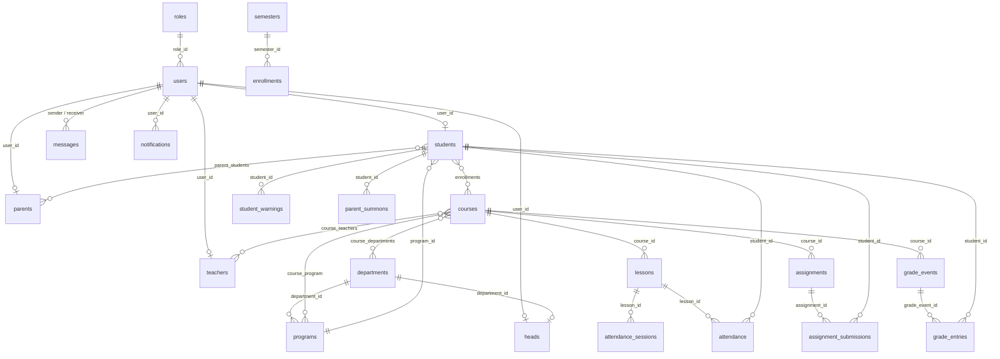

# Database Dictionary

> Auto-generated from the real migrations (run `php artisan migrate` on an empty database, then read `information_schema`). **62 tables and 3 views, 579 columns, 72 foreign keys.**

## Read this first

- **Primary keys are custom, not `id`**, in most tables: `user_id`, `student_id`, `teacher_id`, `course_id`, `lesson_id`... (exceptions: `programs.id`, `grade_events.id`, `attendance_sessions.id`).
- **There are more logical relations than declared foreign keys** (only 72 FKs). Much of the linking is done in code with no database constraint, e.g. `parent_students` and `leave_requests.student_id`.
- **Consistency warning:** `parent_students.parent_id/student_id` and `leave_requests.student_id` may hold `users.user_id` or the internal id (`parents.parent_id` / `students.student_id`). The code handles both (see `08-project-status.md`, item B-04).
- Legacy tables still present: `chats`, `user_activity`, `session`, `otps`, `subjects`. They appear unused (verify before dropping).

## Relationship diagram (core tables)

Shows the most important tables and relations (declared foreign keys plus logical relations documented from the models). Mermaid format, rendered automatically on GitHub and the documentation site.

## Table index

| Table | Type | Description |
|---|---|---|
| [`absence_requests`](#absence_requests) | Table | Absence permission requests |
| [`admin_generated_reports`](#admin_generated_reports) | Table | Log of reports generated by the administration |
| [`admin_profile_stats_view`](#admin_profile_stats_view) | View | View: admin profile statistics |
| [`admins`](#admins) | Table | Administrator profile |
| [`affairs_dashboard_stats_view`](#affairs_dashboard_stats_view) | View | View: Affairs dashboard statistics |
| [`announcements`](#announcements) | Table | Announcements and activities (target audience, images, link, event details) |
| [`assignment_submissions`](#assignment_submissions) | Table | Student submissions and grading |
| [`assignments`](#assignments) | Table | Assignments |
| [`attendance`](#attendance) | Table | Attendance log: status, device, location, face match score, reject reason, excuse |
| [`attendance_sessions`](#attendance_sessions) | Table | Attendance session: rotating QR token, location and radius, validity |
| [`cache`](#cache) | Table | Laravel cache |
| [`cache_locks`](#cache_locks) | Table | Cache locks |
| [`calendar_events`](#calendar_events) | Table | Academic calendar events |
| [`chats`](#chats) | Table | Legacy chat table |
| [`course_program`](#course_program) | Table | Course-to-program links |
| [`course_teachers`](#course_teachers) | Table | Teachers assigned to courses, with a role (e.g. advisor) |
| [`courses`](#courses) | Table | Courses (title, code, hours, weight, year, semester) |
| [`departments`](#departments) | Table | Academic departments, plus the offline attendance sync policy (offline_sync_policy) |
| [`enrollments`](#enrollments) | Table | Student enrollment in courses per semester |
| [`exams`](#exams) | Table | Exam timetable |
| [`failed_jobs`](#failed_jobs) | Table | Failed jobs |
| [`grade_entries`](#grade_entries) | Table | Per-student scores for each assessment event |
| [`grade_events`](#grade_events) | Table | Assessment events (exam / quiz / oral) with date, time and maximum score |
| [`grade_report_requests`](#grade_report_requests) | Table | Head-of-department requests for grade reports from teachers |
| [`grades`](#grades) | Table | Exam grades (legacy system) |
| [`group_user`](#group_user) | Table | Group members |
| [`groups`](#groups) | Table | Chat groups |
| [`head_schedule_entries`](#head_schedule_entries) | Table | Timetable entries created by the head of department |
| [`heads`](#heads) | Table | Heads of department and their department link |
| [`job_batches`](#job_batches) | Table | Job batches |
| [`jobs`](#jobs) | Table | Queue jobs |
| [`leave_requests`](#leave_requests) | Table | Leave requests (student -> parent -> head -> affairs) |
| [`lessons`](#lessons) | Table | Lectures / sessions (file, video, teacher, course); one attendance session is created per lesson |
| [`messages`](#messages) | Table | Chat messages (attachments, reply, forward, delete, disappearing, delivery/read) |
| [`migrations`](#migrations) | Table | - |
| [`notifications`](#notifications) | Table | In-system notifications (type, category, related id) |
| [`otp_codes`](#otp_codes) | Table | Email verification codes (current) |
| [`otps`](#otps) | Table | Verification codes (legacy) |
| [`parent_meeting_requests`](#parent_meeting_requests) | Table | Meeting requests from parents |
| [`parent_students`](#parent_students) | Table | Parent-to-student links (many-to-many) |
| [`parent_summons`](#parent_summons) | Table | Parent summons (manual, or automatic after 10 absence days) |
| [`parents`](#parents) | Table | Parent profile |
| [`performance_reports`](#performance_reports) | Table | Performance reports |
| [`personal_access_tokens`](#personal_access_tokens) | Table | Sanctum tokens |
| [`photo_change_requests`](#photo_change_requests) | Table | Requests to change the student reference photo |
| [`programs`](#programs) | Table | Programs / specializations belonging to departments |
| [`quiz_options`](#quiz_options) | Table | Quiz question options |
| [`quiz_questions`](#quiz_questions) | Table | Quiz questions |
| [`quizzes`](#quizzes) | Table | Online quizzes |
| [`report_requests`](#report_requests) | Table | Behavioral report requests (from head or parent) and head notes |
| [`resources`](#resources) | Table | Course files and references |
| [`roles`](#roles) | Table | The six role definitions |
| [`schedules`](#schedules) | Table | Weekly class timetable (day, time, room, class group) |
| [`semesters`](#semesters) | Table | Academic semesters and the active-semester flag |
| [`session`](#session) | Table | Legacy sessions table |
| [`student_requests`](#student_requests) | Table | Student service requests (appeal, documents, make-up exam, device unlock) |
| [`student_warnings`](#student_warnings) | Table | Automatic absence warnings (first / second / final) |
| [`students`](#students) | Table | Student profile: code, level, program, device binding, reference face embedding |
| [`system_settings`](#system_settings) | Table | System settings (theme) |
| [`teacher_dashboard_stats_view`](#teacher_dashboard_stats_view) | View | View: teacher dashboard statistics |
| [`teachers`](#teachers) | Table | Teacher profile, plus advisor fields (advisor_branch / advisor_year) |
| [`university_ids`](#university_ids) | Table | Pre-registered university IDs created by Affairs before a student registers |
| [`user_activities`](#user_activities) | Table | User activity log (audit) |
| [`user_activity`](#user_activity) | Table | Legacy activity log |
| [`users`](#users) | Table | Core accounts for all roles (login, role, status, session, account lockout, FCM token, Telegram id) |

---

## absence_requests

Absence permission requests

| Column | Type | Null | Default | Key | Notes |
|---|---|---|---|---|---|
| `request_id` | `bigint(20) unsigned` | No |  | PK | auto-increment |
| `student_id` | `bigint(20) unsigned` | No |  | INDEX |  |
| `date` | `date` | No |  |  |  |
| `reason` | `text` | No |  |  |  |
| `document` | `varchar(255)` | Yes | NULL |  |  |
| `status` | `varchar(50)` | No | 'pending_parent' |  |  |
| `reviewed_by` | `bigint(20) unsigned` | Yes | NULL | INDEX |  |
| `created_at` | `timestamp` | Yes | NULL |  |  |
| `updated_at` | `timestamp` | Yes | NULL |  |  |

**Foreign keys:** `student_id` -> `students.student_id`, `reviewed_by` -> `users.user_id`

## admin_generated_reports

Log of reports generated by the administration

| Column | Type | Null | Default | Key | Notes |
|---|---|---|---|---|---|
| `id` | `bigint(20) unsigned` | No |  | PK | auto-increment |
| `title` | `varchar(255)` | No |  |  |  |
| `report_type` | `varchar(255)` | No |  |  |  |
| `department_id` | `bigint(20) unsigned` | Yes | NULL |  |  |
| `department_name` | `varchar(255)` | Yes | NULL |  |  |
| `program_id` | `bigint(20) unsigned` | Yes | NULL |  |  |
| `program_name` | `varchar(255)` | Yes | NULL |  |  |
| `semester_id` | `bigint(20) unsigned` | Yes | NULL |  |  |
| `semester_name` | `varchar(255)` | Yes | NULL |  |  |
| `from_date` | `date` | Yes | NULL |  |  |
| `to_date` | `date` | Yes | NULL |  |  |
| `created_at` | `timestamp` | Yes | NULL |  |  |
| `updated_at` | `timestamp` | Yes | NULL |  |  |

## admin_profile_stats_view

View: admin profile statistics

| Column | Type | Null | Default | Key | Notes |
|---|---|---|---|---|---|
| `total_users` | `bigint(21)` | Yes | NULL |  |  |
| `total_courses` | `bigint(21)` | Yes | NULL |  |  |

## admins

Administrator profile

| Column | Type | Null | Default | Key | Notes |
|---|---|---|---|---|---|
| `admin_id` | `bigint(20) unsigned` | No |  | PK | auto-increment |
| `user_id` | `bigint(20) unsigned` | No |  | INDEX |  |
| `created_at` | `timestamp` | Yes | NULL |  |  |
| `updated_at` | `timestamp` | Yes | NULL |  |  |

**Foreign keys:** `user_id` -> `users.user_id`

## affairs_dashboard_stats_view

View: Affairs dashboard statistics

| Column | Type | Null | Default | Key | Notes |
|---|---|---|---|---|---|
| `total_students` | `bigint(21)` | Yes | NULL |  |  |
| `total_teachers` | `bigint(21)` | Yes | NULL |  |  |
| `total_staff` | `bigint(21)` | Yes | NULL |  |  |
| `pending_leaves` | `bigint(21)` | Yes | NULL |  |  |
| `total_users` | `bigint(21)` | Yes | NULL |  |  |

## announcements

Announcements and activities (target audience, images, link, event details)

| Column | Type | Null | Default | Key | Notes |
|---|---|---|---|---|---|
| `announcement_id` | `bigint(20) unsigned` | No |  | PK | auto-increment |
| `user_id` | `bigint(20) unsigned` | No |  | INDEX |  |
| `title` | `varchar(255)` | No |  |  |  |
| `content` | `text` | No |  |  |  |
| `image_path` | `varchar(255)` | Yes | NULL |  |  |
| `category` | `varchar(255)` | Yes | 'general' |  |  |
| `image` | `varchar(255)` | Yes | NULL |  |  |
| `images` | `longtext` | Yes | NULL |  |  |
| `link_url` | `varchar(255)` | Yes | NULL |  |  |
| `type` | `enum('general','course_specific')` | No | 'general' |  |  |
| `target_audience` | `varchar(255)` | No | 'all' | INDEX |  |
| `target_role` | `varchar(255)` | Yes | NULL |  |  |
| `department_id` | `bigint(20) unsigned` | Yes | NULL | INDEX |  |
| `academic_year` | `varchar(255)` | Yes | NULL |  |  |
| `course_id` | `bigint(20) unsigned` | Yes | NULL | INDEX |  |
| `created_at` | `timestamp` | Yes | NULL | INDEX |  |
| `updated_at` | `timestamp` | Yes | NULL |  |  |
| `event_date` | `date` | Yes | NULL |  |  |
| `event_time` | `time` | Yes | NULL |  |  |
| `location` | `varchar(255)` | Yes | NULL |  |  |

**Foreign keys:** `user_id` -> `users.user_id`, `course_id` -> `courses.course_id`

## assignment_submissions

Student submissions and grading

| Column | Type | Null | Default | Key | Notes |
|---|---|---|---|---|---|
| `submission_id` | `bigint(20) unsigned` | No |  | PK | auto-increment |
| `assignment_id` | `bigint(20) unsigned` | No |  | INDEX |  |
| `student_id` | `bigint(20) unsigned` | No |  | INDEX |  |
| `file_path` | `varchar(255)` | Yes | NULL |  |  |
| `solution_text` | `text` | Yes | NULL |  |  |
| `student_notes` | `text` | Yes | NULL |  |  |
| `grade` | `decimal(5,2)` | Yes | NULL |  |  |
| `feedback` | `text` | Yes | NULL |  |  |
| `submitted_at` | `datetime` | No |  |  |  |
| `created_at` | `timestamp` | Yes | NULL |  |  |
| `updated_at` | `timestamp` | Yes | NULL |  |  |

**Foreign keys:** `student_id` -> `students.student_id`, `assignment_id` -> `assignments.assignment_id`

## assignments

Assignments

| Column | Type | Null | Default | Key | Notes |
|---|---|---|---|---|---|
| `assignment_id` | `bigint(20) unsigned` | No |  | PK | auto-increment |
| `course_id` | `bigint(20) unsigned` | No |  | INDEX |  |
| `teacher_id` | `bigint(20) unsigned` | Yes | NULL | INDEX |  |
| `title` | `varchar(255)` | No |  |  |  |
| `description` | `text` | Yes | NULL |  |  |
| `notes` | `text` | Yes | NULL |  |  |
| `file_path` | `varchar(255)` | Yes | NULL |  |  |
| `file_name` | `varchar(255)` | Yes | NULL |  |  |
| `file_type` | `varchar(255)` | Yes | NULL |  |  |
| `due_date` | `datetime` | No |  |  |  |
| `max_points` | `int(11)` | No | 100 |  |  |
| `attachment_path` | `varchar(255)` | Yes | NULL |  |  |
| `created_at` | `timestamp` | Yes | NULL |  |  |
| `updated_at` | `timestamp` | Yes | NULL |  |  |

**Foreign keys:** `teacher_id` -> `teachers.teacher_id`, `course_id` -> `courses.course_id`

## attendance

Attendance log: status, device, location, face match score, reject reason, excuse

| Column | Type | Null | Default | Key | Notes |
|---|---|---|---|---|---|
| `attendance_id` | `bigint(20) unsigned` | No |  | PK | auto-increment |
| `student_id` | `bigint(20) unsigned` | No |  | INDEX |  |
| `lesson_id` | `bigint(20) unsigned` | No |  | INDEX |  |
| `status` | `enum('present','absent','late')` | No |  |  |  |
| `device_id` | `varchar(255)` | Yes | NULL |  | معرّف الجهاز الذي سجّل الحضور |
| `latitude` | `decimal(10,7)` | Yes | NULL |  | خط عرض موقع الطالب لحظة المسح |
| `longitude` | `decimal(10,7)` | Yes | NULL |  | خط طول موقع الطالب لحظة المسح |
| `reject_reason` | `enum('expired_qr','device_mismatch','location_too_far','already_marked','session_closed','face_mismatch')` | Yes | NULL |  |  |
| `face_image` | `mediumtext` | Yes | NULL |  |  |
| `face_score` | `double` | Yes | NULL |  |  |
| `face_status` | `enum('first_time','verified','suspicious','rejected')` | Yes | NULL |  |  |
| `attendance_date` | `date` | No |  |  |  |
| `excuse_text` | `text` | Yes | NULL |  |  |
| `excuse_attachment` | `varchar(255)` | Yes | NULL |  |  |
| `excuse_status` | `enum('none','pending','approved','rejected')` | No | 'none' |  |  |
| `created_at` | `timestamp` | Yes | NULL |  |  |
| `updated_at` | `timestamp` | Yes | NULL |  |  |

**Foreign keys:** `student_id` -> `students.student_id`, `lesson_id` -> `lessons.lesson_id`

## attendance_sessions

Attendance session: rotating QR token, location and radius, validity

| Column | Type | Null | Default | Key | Notes |
|---|---|---|---|---|---|
| `id` | `bigint(20) unsigned` | No |  | PK | auto-increment |
| `lesson_id` | `bigint(20) unsigned` | No |  | INDEX |  |
| `qr_token` | `varchar(255)` | No |  | UNIQUE |  |
| `expires_at` | `timestamp` | No | current_timestamp() |  |  |
| `session_expires_at` | `timestamp` | Yes | NULL |  |  |
| `is_active` | `tinyint(1)` | No | 1 |  |  |
| `closed_at` | `timestamp` | Yes | NULL |  | وقت إغلاق الجلسة من المعلم |
| `latitude` | `decimal(10,7)` | Yes | NULL |  | خط عرض موقع المعلم عند فتح الجلسة |
| `longitude` | `decimal(10,7)` | Yes | NULL |  | خط طول موقع المعلم عند فتح الجلسة |
| `radius_meters` | `smallint(5) unsigned` | No | 50 |  | الحد الأقصى للمسافة المسموح بها بالمتر (افتراضي 50م) |
| `created_at` | `timestamp` | Yes | NULL |  |  |
| `updated_at` | `timestamp` | Yes | NULL |  |  |

**Foreign keys:** `lesson_id` -> `lessons.lesson_id`

## cache

Laravel cache

| Column | Type | Null | Default | Key | Notes |
|---|---|---|---|---|---|
| `key` | `varchar(255)` | No |  | PK |  |
| `value` | `mediumtext` | No |  |  |  |
| `expiration` | `int(11)` | No |  | INDEX |  |

## cache_locks

Cache locks

| Column | Type | Null | Default | Key | Notes |
|---|---|---|---|---|---|
| `key` | `varchar(255)` | No |  | PK |  |
| `owner` | `varchar(255)` | No |  |  |  |
| `expiration` | `int(11)` | No |  | INDEX |  |

## calendar_events

Academic calendar events

| Column | Type | Null | Default | Key | Notes |
|---|---|---|---|---|---|
| `id` | `bigint(20) unsigned` | No |  | PK | auto-increment |
| `user_id` | `bigint(20) unsigned` | No |  | INDEX |  |
| `title` | `varchar(255)` | No |  |  |  |
| `event_date` | `date` | No |  |  |  |
| `event_time` | `time` | Yes | NULL |  |  |
| `location` | `varchar(255)` | Yes | NULL |  |  |
| `department_id` | `bigint(20) unsigned` | Yes | NULL | INDEX |  |
| `created_at` | `timestamp` | Yes | NULL |  |  |
| `updated_at` | `timestamp` | Yes | NULL |  |  |

**Foreign keys:** `user_id` -> `users.user_id`, `department_id` -> `departments.department_id`

## chats

Legacy chat table

| Column | Type | Null | Default | Key | Notes |
|---|---|---|---|---|---|
| `chat_id` | `bigint(20) unsigned` | No |  | PK | auto-increment |
| `sender_id` | `bigint(20) unsigned` | No |  | INDEX |  |
| `receiver_id` | `bigint(20) unsigned` | No |  | INDEX |  |
| `content` | `text` | No |  |  |  |
| `sent_at` | `timestamp` | No | current_timestamp() |  |  |
| `created_at` | `timestamp` | Yes | NULL |  |  |
| `updated_at` | `timestamp` | Yes | NULL |  |  |

**Foreign keys:** `sender_id` -> `users.user_id`, `receiver_id` -> `users.user_id`

## course_program

Course-to-program links

| Column | Type | Null | Default | Key | Notes |
|---|---|---|---|---|---|
| `id` | `bigint(20) unsigned` | No |  | PK | auto-increment |
| `course_id` | `bigint(20) unsigned` | No |  | INDEX |  |
| `program_id` | `bigint(20) unsigned` | No |  | INDEX |  |
| `created_at` | `timestamp` | Yes | NULL |  |  |
| `updated_at` | `timestamp` | Yes | NULL |  |  |

**Foreign keys:** `program_id` -> `programs.id`, `course_id` -> `courses.course_id`

## course_teachers

Teachers assigned to courses, with a role (e.g. advisor)

| Column | Type | Null | Default | Key | Notes |
|---|---|---|---|---|---|
| `course_teacher_id` | `bigint(20) unsigned` | No |  | PK | auto-increment |
| `course_id` | `bigint(20) unsigned` | No |  | INDEX |  |
| `teacher_id` | `bigint(20) unsigned` | No |  | INDEX |  |
| `role` | `varchar(255)` | Yes | NULL |  |  |
| `created_at` | `timestamp` | Yes | NULL |  |  |
| `updated_at` | `timestamp` | Yes | NULL |  |  |

**Foreign keys:** `course_id` -> `courses.course_id`, `teacher_id` -> `teachers.teacher_id`

## courses

Courses (title, code, hours, weight, year, semester)

| Column | Type | Null | Default | Key | Notes |
|---|---|---|---|---|---|
| `course_id` | `bigint(20) unsigned` | No |  | PK | auto-increment |
| `code` | `varchar(50)` | Yes | NULL |  | رمز المادة الدراسية |
| `title` | `varchar(255)` | No |  |  |  |
| `weight` | `int(11)` | No | 1 |  | تثقيل المادة (عدد الساعات) |
| `description` | `text` | Yes | NULL |  |  |
| `level` | `varchar(255)` | No |  |  |  |
| `hours` | `int(11)` | No | 0 |  |  |
| `year` | `tinyint(4)` | Yes | 1 |  |  |
| `semester_id` | `bigint(20) unsigned` | Yes | NULL | INDEX |  |
| `created_at` | `timestamp` | Yes | NULL |  |  |
| `updated_at` | `timestamp` | Yes | NULL |  |  |

**Foreign keys:** `semester_id` -> `semesters.semester_id`

## departments

Academic departments, plus the offline attendance sync policy (offline_sync_policy)

| Column | Type | Null | Default | Key | Notes |
|---|---|---|---|---|---|
| `department_id` | `bigint(20) unsigned` | No |  | PK | auto-increment |
| `name` | `varchar(255)` | No |  |  |  |
| `description` | `text` | Yes | NULL |  |  |
| `offline_sync_policy` | `varchar(255)` | No | 'anytime' |  |  |
| `created_at` | `timestamp` | Yes | NULL |  |  |
| `updated_at` | `timestamp` | Yes | NULL |  |  |

## enrollments

Student enrollment in courses per semester

| Column | Type | Null | Default | Key | Notes |
|---|---|---|---|---|---|
| `enrollment_id` | `bigint(20) unsigned` | No |  | PK | auto-increment |
| `student_id` | `bigint(20) unsigned` | No |  | INDEX |  |
| `course_id` | `bigint(20) unsigned` | No |  | INDEX |  |
| `enrollment_date` | `date` | No |  |  |  |
| `status` | `varchar(255)` | No | 'active' |  |  |
| `created_at` | `timestamp` | Yes | NULL |  |  |
| `updated_at` | `timestamp` | Yes | NULL |  |  |

**Foreign keys:** `student_id` -> `students.student_id`, `course_id` -> `courses.course_id`

## exams

Exam timetable

| Column | Type | Null | Default | Key | Notes |
|---|---|---|---|---|---|
| `exam_id` | `bigint(20) unsigned` | No |  | PK | auto-increment |
| `course_id` | `bigint(20) unsigned` | No |  | INDEX |  |
| `exam_name` | `varchar(255)` | No |  |  |  |
| `exam_date` | `datetime` | No |  |  |  |
| `room` | `varchar(255)` | Yes | NULL |  |  |
| `class_group` | `varchar(255)` | Yes | NULL |  |  |
| `max_score` | `int(11)` | No | 100 |  |  |
| `created_at` | `timestamp` | Yes | NULL |  |  |
| `updated_at` | `timestamp` | Yes | NULL |  |  |

**Foreign keys:** `course_id` -> `courses.course_id`

## failed_jobs

Failed jobs

| Column | Type | Null | Default | Key | Notes |
|---|---|---|---|---|---|
| `id` | `bigint(20) unsigned` | No |  | PK | auto-increment |
| `uuid` | `varchar(255)` | No |  | UNIQUE |  |
| `connection` | `text` | No |  |  |  |
| `queue` | `text` | No |  |  |  |
| `payload` | `longtext` | No |  |  |  |
| `exception` | `longtext` | No |  |  |  |
| `failed_at` | `timestamp` | No | current_timestamp() |  |  |

## grade_entries

Per-student scores for each assessment event

| Column | Type | Null | Default | Key | Notes |
|---|---|---|---|---|---|
| `id` | `bigint(20) unsigned` | No |  | PK | auto-increment |
| `grade_event_id` | `bigint(20) unsigned` | No |  | INDEX |  |
| `student_id` | `bigint(20) unsigned` | No |  | INDEX |  |
| `score` | `decimal(5,2)` | Yes | NULL |  |  |
| `notes` | `text` | Yes | NULL |  |  |
| `created_at` | `timestamp` | Yes | NULL |  |  |
| `updated_at` | `timestamp` | Yes | NULL |  |  |

**Foreign keys:** `student_id` -> `students.student_id`, `grade_event_id` -> `grade_events.id`

## grade_events

Assessment events (exam / quiz / oral) with date, time and maximum score

| Column | Type | Null | Default | Key | Notes |
|---|---|---|---|---|---|
| `id` | `bigint(20) unsigned` | No |  | PK | auto-increment |
| `teacher_id` | `bigint(20) unsigned` | No |  | INDEX |  |
| `course_id` | `bigint(20) unsigned` | Yes | NULL | INDEX |  |
| `program_id` | `bigint(20) unsigned` | Yes | NULL |  |  |
| `year_level` | `tinyint(4)` | Yes | NULL |  |  |
| `type` | `enum('exam','quiz','oral')` | No |  | INDEX |  |
| `title` | `varchar(255)` | No |  |  |  |
| `max_score` | `decimal(5,2)` | No | 100.00 |  |  |
| `notes` | `text` | Yes | NULL |  |  |
| `date` | `date` | No |  |  |  |
| `time` | `varchar(255)` | Yes | NULL |  |  |
| `duration` | `varchar(255)` | Yes | NULL |  |  |
| `created_at` | `timestamp` | Yes | NULL |  |  |
| `updated_at` | `timestamp` | Yes | NULL |  |  |

**Foreign keys:** `teacher_id` -> `teachers.teacher_id`, `course_id` -> `courses.course_id`

## grade_report_requests

Head-of-department requests for grade reports from teachers

| Column | Type | Null | Default | Key | Notes |
|---|---|---|---|---|---|
| `id` | `bigint(20) unsigned` | No |  | PK | auto-increment |
| `boss_user_id` | `bigint(20) unsigned` | No |  |  |  |
| `teacher_user_id` | `bigint(20) unsigned` | No |  |  |  |
| `course_id` | `bigint(20) unsigned` | No |  | INDEX |  |
| `status` | `varchar(255)` | No | 'pending' |  |  |
| `notes` | `text` | Yes | NULL |  |  |
| `created_at` | `timestamp` | Yes | NULL |  |  |
| `updated_at` | `timestamp` | Yes | NULL |  |  |

**Foreign keys:** `course_id` -> `courses.course_id`

## grades

Exam grades (legacy system)

| Column | Type | Null | Default | Key | Notes |
|---|---|---|---|---|---|
| `grade_id` | `bigint(20) unsigned` | No |  | PK | auto-increment |
| `student_id` | `bigint(20) unsigned` | No |  | INDEX |  |
| `exam_id` | `bigint(20) unsigned` | No |  | INDEX |  |
| `score` | `decimal(5,2)` | No |  |  |  |
| `remarks` | `text` | Yes | NULL |  |  |
| `created_at` | `timestamp` | Yes | NULL |  |  |
| `updated_at` | `timestamp` | Yes | NULL |  |  |

**Foreign keys:** `student_id` -> `students.student_id`, `exam_id` -> `exams.exam_id`

## group_user

Group members

| Column | Type | Null | Default | Key | Notes |
|---|---|---|---|---|---|
| `id` | `bigint(20) unsigned` | No |  | PK | auto-increment |
| `group_id` | `bigint(20) unsigned` | No |  | INDEX |  |
| `user_id` | `bigint(20) unsigned` | No |  | INDEX |  |
| `created_at` | `timestamp` | Yes | NULL |  |  |
| `updated_at` | `timestamp` | Yes | NULL |  |  |

**Foreign keys:** `user_id` -> `users.user_id`, `group_id` -> `groups.id`

## groups

Chat groups

| Column | Type | Null | Default | Key | Notes |
|---|---|---|---|---|---|
| `id` | `bigint(20) unsigned` | No |  | PK | auto-increment |
| `name` | `varchar(255)` | No |  |  |  |
| `image` | `varchar(255)` | Yes | NULL |  |  |
| `created_at` | `timestamp` | Yes | NULL |  |  |
| `updated_at` | `timestamp` | Yes | NULL |  |  |

## head_schedule_entries

Timetable entries created by the head of department

| Column | Type | Null | Default | Key | Notes |
|---|---|---|---|---|---|
| `id` | `bigint(20) unsigned` | No |  | PK | auto-increment |
| `created_at` | `timestamp` | Yes | NULL |  |  |
| `updated_at` | `timestamp` | Yes | NULL |  |  |

## heads

Heads of department and their department link

| Column | Type | Null | Default | Key | Notes |
|---|---|---|---|---|---|
| `head_id` | `bigint(20) unsigned` | No |  | PK | auto-increment |
| `user_id` | `bigint(20) unsigned` | No |  | INDEX |  |
| `department_id` | `bigint(20) unsigned` | No |  | INDEX |  |
| `created_at` | `timestamp` | Yes | NULL |  |  |
| `updated_at` | `timestamp` | Yes | NULL |  |  |

**Foreign keys:** `department_id` -> `departments.department_id`, `user_id` -> `users.user_id`

## job_batches

Job batches

| Column | Type | Null | Default | Key | Notes |
|---|---|---|---|---|---|
| `id` | `varchar(255)` | No |  | PK |  |
| `name` | `varchar(255)` | No |  |  |  |
| `total_jobs` | `int(11)` | No |  |  |  |
| `pending_jobs` | `int(11)` | No |  |  |  |
| `failed_jobs` | `int(11)` | No |  |  |  |
| `failed_job_ids` | `longtext` | No |  |  |  |
| `options` | `mediumtext` | Yes | NULL |  |  |
| `cancelled_at` | `int(11)` | Yes | NULL |  |  |
| `created_at` | `int(11)` | No |  |  |  |
| `finished_at` | `int(11)` | Yes | NULL |  |  |

## jobs

Queue jobs

| Column | Type | Null | Default | Key | Notes |
|---|---|---|---|---|---|
| `id` | `bigint(20) unsigned` | No |  | PK | auto-increment |
| `queue` | `varchar(255)` | No |  | INDEX |  |
| `payload` | `longtext` | No |  |  |  |
| `attempts` | `tinyint(3) unsigned` | No |  |  |  |
| `reserved_at` | `int(10) unsigned` | Yes | NULL |  |  |
| `available_at` | `int(10) unsigned` | No |  |  |  |
| `created_at` | `int(10) unsigned` | No |  |  |  |

## leave_requests

Leave requests (student -> parent -> head -> affairs)

| Column | Type | Null | Default | Key | Notes |
|---|---|---|---|---|---|
| `id` | `bigint(20) unsigned` | No |  | PK | auto-increment |
| `student_id` | `bigint(20) unsigned` | Yes | NULL | INDEX |  |
| `teacher_id` | `bigint(20) unsigned` | Yes | NULL | INDEX |  |
| `type` | `enum('full_day','hourly')` | No |  |  |  |
| `leave_category` | `enum('hourly','daily')` | No | 'daily' |  |  |
| `date` | `date` | No |  |  |  |
| `reason` | `text` | No |  |  |  |
| `attachment` | `varchar(255)` | Yes | NULL |  |  |
| `status` | `varchar(50)` | No | 'pending_parent' | INDEX |  |
| `created_at` | `timestamp` | Yes | NULL |  |  |
| `updated_at` | `timestamp` | Yes | NULL |  |  |

**Foreign keys:** `teacher_id` -> `teachers.teacher_id`, `student_id` -> `users.user_id`

## lessons

Lectures / sessions (file, video, teacher, course); one attendance session is created per lesson

| Column | Type | Null | Default | Key | Notes |
|---|---|---|---|---|---|
| `lesson_id` | `bigint(20) unsigned` | No |  | PK | auto-increment |
| `course_id` | `bigint(20) unsigned` | No |  | INDEX |  |
| `title` | `varchar(255)` | No |  |  |  |
| `description` | `text` | Yes | NULL |  |  |
| `file_path` | `varchar(255)` | Yes | NULL |  |  |
| `file_name` | `varchar(255)` | Yes | NULL |  |  |
| `file_type` | `varchar(255)` | Yes | NULL |  |  |
| `content_url` | `varchar(255)` | Yes | NULL |  |  |
| `type` | `varchar(255)` | Yes | NULL |  |  |
| `file_size` | `varchar(255)` | Yes | NULL |  |  |
| `duration` | `varchar(255)` | Yes | NULL |  |  |
| `created_at` | `timestamp` | Yes | NULL |  |  |
| `updated_at` | `timestamp` | Yes | NULL |  |  |
| `teacher_id` | `bigint(20) unsigned` | Yes | NULL | INDEX |  |
| `department_id` | `bigint(20) unsigned` | Yes | NULL | INDEX |  |

**Foreign keys:** `course_id` -> `courses.course_id`, `teacher_id` -> `teachers.teacher_id`, `department_id` -> `departments.department_id`

## messages

Chat messages (attachments, reply, forward, delete, disappearing, delivery/read)

| Column | Type | Null | Default | Key | Notes |
|---|---|---|---|---|---|
| `id` | `bigint(20) unsigned` | No |  | PK | auto-increment |
| `sender_id` | `bigint(20) unsigned` | No |  | INDEX |  |
| `receiver_id` | `bigint(20) unsigned` | Yes | NULL | INDEX |  |
| `group_id` | `bigint(20) unsigned` | Yes | NULL |  |  |
| `course_id` | `bigint(20) unsigned` | Yes | NULL |  |  |
| `message` | `text` | Yes | NULL |  |  |
| `reply_to_message_id` | `bigint(20) unsigned` | Yes | NULL |  |  |
| `attachment` | `varchar(255)` | Yes | NULL |  |  |
| `is_read` | `tinyint(1)` | No | 0 |  |  |
| `is_delivered` | `tinyint(1)` | No | 0 |  |  |
| `deleted_for_sender` | `tinyint(1)` | No | 0 |  |  |
| `deleted_for_receiver` | `tinyint(1)` | No | 0 |  |  |
| `deleted_for_everyone` | `tinyint(1)` | No | 0 |  |  |
| `expires_at` | `timestamp` | Yes | NULL |  |  |
| `disappears_after` | `int(11)` | Yes | NULL |  |  |
| `is_forwarded` | `tinyint(1)` | No | 0 |  |  |
| `created_at` | `timestamp` | Yes | NULL | INDEX |  |
| `updated_at` | `timestamp` | Yes | NULL |  |  |

**Foreign keys:** `receiver_id` -> `users.user_id`, `sender_id` -> `users.user_id`

## migrations

| Column | Type | Null | Default | Key | Notes |
|---|---|---|---|---|---|
| `id` | `int(10) unsigned` | No |  | PK | auto-increment |
| `migration` | `varchar(255)` | No |  |  |  |
| `batch` | `int(11)` | No |  |  |  |

## notifications

In-system notifications (type, category, related id)

| Column | Type | Null | Default | Key | Notes |
|---|---|---|---|---|---|
| `id` | `bigint(20) unsigned` | No |  | PK | auto-increment |
| `user_id` | `bigint(20) unsigned` | No |  | INDEX |  |
| `sender_id` | `bigint(20) unsigned` | Yes | NULL | INDEX |  |
| `title` | `varchar(255)` | No |  |  |  |
| `message` | `text` | No |  |  |  |
| `type` | `varchar(255)` | No |  | INDEX |  |
| `related_id` | `bigint(20) unsigned` | Yes | NULL |  |  |
| `category` | `enum('academic','administrative','chat')` | Yes | 'administrative' |  |  |
| `is_read` | `tinyint(1)` | No | 0 | INDEX |  |
| `created_at` | `timestamp` | Yes | NULL |  |  |
| `updated_at` | `timestamp` | Yes | NULL |  |  |

**Foreign keys:** `user_id` -> `users.user_id`, `sender_id` -> `users.user_id`

## otp_codes

Email verification codes (current)

| Column | Type | Null | Default | Key | Notes |
|---|---|---|---|---|---|
| `id` | `bigint(20) unsigned` | No |  | PK | auto-increment |
| `email` | `varchar(255)` | No |  | INDEX |  |
| `code` | `varchar(6)` | No |  |  |  |
| `expires_at` | `timestamp` | No | current_timestamp() |  |  |
| `used` | `tinyint(1)` | No | 0 |  |  |
| `created_at` | `timestamp` | Yes | NULL |  |  |
| `updated_at` | `timestamp` | Yes | NULL |  |  |

## otps

Verification codes (legacy)

| Column | Type | Null | Default | Key | Notes |
|---|---|---|---|---|---|
| `id` | `bigint(20) unsigned` | No |  | PK | auto-increment |
| `email` | `varchar(255)` | No |  | INDEX |  |
| `token` | `varchar(255)` | No |  |  |  |
| `expires_at` | `timestamp` | No | current_timestamp() |  |  |
| `created_at` | `timestamp` | Yes | NULL |  |  |
| `updated_at` | `timestamp` | Yes | NULL |  |  |

## parent_meeting_requests

Meeting requests from parents

| Column | Type | Null | Default | Key | Notes |
|---|---|---|---|---|---|
| `id` | `bigint(20) unsigned` | No |  | PK | auto-increment |
| `parent_user_id` | `bigint(20) unsigned` | No |  | INDEX |  |
| `student_id` | `bigint(20) unsigned` | Yes | NULL | INDEX |  |
| `target_role` | `varchar(255)` | Yes | 'affairs' |  |  |
| `department_id` | `bigint(20) unsigned` | Yes | NULL |  |  |
| `target_user_id` | `bigint(20) unsigned` | Yes | NULL |  |  |
| `subject` | `varchar(255)` | No |  |  |  |
| `reason` | `text` | No |  |  |  |
| `preferred_date` | `date` | Yes | NULL |  |  |
| `status` | `enum('pending','approved','rejected','completed')` | No | 'pending' |  |  |
| `admin_response` | `text` | Yes | NULL |  |  |
| `scheduled_at` | `datetime` | Yes | NULL |  |  |
| `created_at` | `timestamp` | Yes | NULL |  |  |
| `updated_at` | `timestamp` | Yes | NULL |  |  |

**Foreign keys:** `student_id` -> `students.student_id`, `parent_user_id` -> `users.user_id`

## parent_students

Parent-to-student links (many-to-many)

| Column | Type | Null | Default | Key | Notes |
|---|---|---|---|---|---|
| `id` | `bigint(20) unsigned` | No |  | PK | auto-increment |
| `parent_id` | `bigint(20) unsigned` | No |  | INDEX |  |
| `student_id` | `bigint(20) unsigned` | No |  | INDEX |  |
| `relationship` | `enum('father','mother','guardian')` | No | 'father' |  |  |
| `created_at` | `timestamp` | Yes | NULL |  |  |
| `updated_at` | `timestamp` | Yes | NULL |  |  |

**Foreign keys:** `student_id` -> `users.user_id`, `parent_id` -> `users.user_id`

## parent_summons

Parent summons (manual, or automatic after 10 absence days)

| Column | Type | Null | Default | Key | Notes |
|---|---|---|---|---|---|
| `id` | `bigint(20) unsigned` | No |  | PK | auto-increment |
| `sender_user_id` | `bigint(20) unsigned` | No |  | INDEX |  |
| `student_id` | `bigint(20) unsigned` | No |  | INDEX |  |
| `parent_user_id` | `bigint(20) unsigned` | Yes | NULL | INDEX |  |
| `subject` | `varchar(255)` | Yes | NULL |  |  |
| `reason` | `text` | Yes | NULL |  |  |
| `date` | `varchar(255)` | Yes | NULL |  |  |
| `time` | `varchar(255)` | Yes | NULL |  |  |
| `reason_title` | `varchar(255)` | No |  |  |  |
| `details` | `text` | No |  |  |  |
| `summon_date` | `date` | Yes | NULL |  |  |
| `status` | `enum('pending_hod','pending_affairs','sent','acknowledged','attended','cancelled','approved','rejected','completed')` | No | 'sent' | INDEX |  |
| `created_at` | `timestamp` | Yes | NULL |  |  |
| `updated_at` | `timestamp` | Yes | NULL |  |  |

**Foreign keys:** `sender_user_id` -> `users.user_id`, `student_id` -> `students.student_id`

## parents

Parent profile

| Column | Type | Null | Default | Key | Notes |
|---|---|---|---|---|---|
| `parent_id` | `bigint(20) unsigned` | No |  | PK | auto-increment |
| `user_id` | `bigint(20) unsigned` | No |  | INDEX |  |
| `created_at` | `timestamp` | Yes | NULL |  |  |
| `updated_at` | `timestamp` | Yes | NULL |  |  |
| `telegram_id` | `varchar(255)` | Yes | NULL |  |  |

**Foreign keys:** `user_id` -> `users.user_id`

## performance_reports

Performance reports

| Column | Type | Null | Default | Key | Notes |
|---|---|---|---|---|---|
| `report_id` | `bigint(20) unsigned` | No |  | PK | auto-increment |
| `report_request_id` | `bigint(20) unsigned` | Yes | NULL |  |  |
| `student_id` | `bigint(20) unsigned` | No |  | INDEX |  |
| `report_type` | `enum('academic','behavioral')` | No | 'academic' |  |  |
| `attendance_rate` | `decimal(5,2)` | No |  |  |  |
| `average_grade` | `decimal(5,2)` | No |  |  |  |
| `recommendations` | `text` | Yes | NULL |  |  |
| `generated_at` | `timestamp` | No | current_timestamp() |  |  |
| `created_at` | `timestamp` | Yes | NULL |  |  |
| `updated_at` | `timestamp` | Yes | NULL |  |  |

**Foreign keys:** `student_id` -> `students.student_id`

## personal_access_tokens

Sanctum tokens

| Column | Type | Null | Default | Key | Notes |
|---|---|---|---|---|---|
| `id` | `bigint(20) unsigned` | No |  | PK | auto-increment |
| `tokenable_type` | `varchar(255)` | No |  | INDEX |  |
| `tokenable_id` | `bigint(20) unsigned` | No |  |  |  |
| `name` | `text` | No |  |  |  |
| `token` | `varchar(64)` | No |  | UNIQUE |  |
| `abilities` | `text` | Yes | NULL |  |  |
| `last_used_at` | `timestamp` | Yes | NULL |  |  |
| `expires_at` | `timestamp` | Yes | NULL | INDEX |  |
| `created_at` | `timestamp` | Yes | NULL |  |  |
| `updated_at` | `timestamp` | Yes | NULL |  |  |

## photo_change_requests

Requests to change the student reference photo

| Column | Type | Null | Default | Key | Notes |
|---|---|---|---|---|---|
| `id` | `bigint(20) unsigned` | No |  | PK | auto-increment |
| `user_id` | `bigint(20) unsigned` | No |  | INDEX |  |
| `old_photo` | `varchar(255)` | Yes | NULL |  |  |
| `new_photo` | `varchar(255)` | No |  |  |  |
| `status` | `enum('pending','approved','rejected')` | No | 'pending' |  |  |
| `reviewed_by` | `bigint(20) unsigned` | Yes | NULL |  |  |
| `created_at` | `timestamp` | Yes | NULL |  |  |
| `updated_at` | `timestamp` | Yes | NULL |  |  |

**Foreign keys:** `user_id` -> `users.user_id`

## programs

Programs / specializations belonging to departments

| Column | Type | Null | Default | Key | Notes |
|---|---|---|---|---|---|
| `id` | `bigint(20) unsigned` | No |  | PK | auto-increment |
| `name` | `varchar(255)` | No |  |  |  |
| `description` | `text` | Yes | NULL |  |  |
| `year` | `varchar(255)` | Yes | NULL |  |  |
| `semester` | `varchar(255)` | Yes | NULL |  |  |
| `department_id` | `bigint(20) unsigned` | Yes | NULL | INDEX |  |
| `created_at` | `timestamp` | Yes | NULL |  |  |
| `updated_at` | `timestamp` | Yes | NULL |  |  |

**Foreign keys:** `department_id` -> `departments.department_id`

## quiz_options

Quiz question options

| Column | Type | Null | Default | Key | Notes |
|---|---|---|---|---|---|
| `id` | `bigint(20) unsigned` | No |  | PK | auto-increment |
| `question_id` | `bigint(20) unsigned` | No |  | INDEX |  |
| `option_text` | `varchar(255)` | No |  |  |  |
| `is_correct` | `tinyint(1)` | No | 0 |  |  |
| `created_at` | `timestamp` | Yes | NULL |  |  |
| `updated_at` | `timestamp` | Yes | NULL |  |  |

**Foreign keys:** `question_id` -> `quiz_questions.id`

## quiz_questions

Quiz questions

| Column | Type | Null | Default | Key | Notes |
|---|---|---|---|---|---|
| `id` | `bigint(20) unsigned` | No |  | PK | auto-increment |
| `quiz_id` | `bigint(20) unsigned` | No |  | INDEX |  |
| `question_text` | `text` | No |  |  |  |
| `type` | `enum('mcq','text')` | No | 'mcq' |  |  |
| `marks` | `smallint(5) unsigned` | No | 1 |  |  |
| `order_num` | `smallint(5) unsigned` | No | 0 |  |  |
| `created_at` | `timestamp` | Yes | NULL |  |  |
| `updated_at` | `timestamp` | Yes | NULL |  |  |

**Foreign keys:** `quiz_id` -> `quizzes.id`

## quizzes

Online quizzes

| Column | Type | Null | Default | Key | Notes |
|---|---|---|---|---|---|
| `id` | `bigint(20) unsigned` | No |  | PK | auto-increment |
| `teacher_id` | `bigint(20) unsigned` | No |  | INDEX |  |
| `course_id` | `bigint(20) unsigned` | No |  | INDEX |  |
| `title` | `varchar(255)` | No |  |  |  |
| `description` | `text` | Yes | NULL |  |  |
| `duration_minutes` | `smallint(5) unsigned` | No | 60 |  |  |
| `total_marks` | `smallint(5) unsigned` | No | 100 |  |  |
| `start_at` | `datetime` | Yes | NULL |  |  |
| `end_at` | `datetime` | Yes | NULL |  |  |
| `is_published` | `tinyint(1)` | No | 0 |  |  |
| `created_at` | `timestamp` | Yes | NULL |  |  |
| `updated_at` | `timestamp` | Yes | NULL |  |  |

**Foreign keys:** `teacher_id` -> `teachers.teacher_id`, `course_id` -> `courses.course_id`

## report_requests

Behavioral report requests (from head or parent) and head notes

| Column | Type | Null | Default | Key | Notes |
|---|---|---|---|---|---|
| `id` | `bigint(20) unsigned` | No |  | PK | auto-increment |
| `head_id` | `bigint(20) unsigned` | No |  | INDEX |  |
| `teacher_id` | `bigint(20) unsigned` | Yes | NULL | INDEX |  |
| `student_id` | `bigint(20) unsigned` | No |  | INDEX |  |
| `course_id` | `bigint(20) unsigned` | Yes | NULL | INDEX |  |
| `year` | `tinyint(4)` | Yes | NULL |  |  |
| `report_type` | `enum('academic','behavioral')` | No |  |  |  |
| `notes` | `text` | Yes | NULL |  |  |
| `hod_notes` | `text` | Yes | NULL |  |  |
| `status` | `enum('pending','completed')` | No | 'pending' |  |  |
| `sent_to_parent` | `tinyint(1)` | No | 0 |  |  |
| `created_at` | `timestamp` | Yes | NULL |  |  |
| `updated_at` | `timestamp` | Yes | NULL |  |  |

**Foreign keys:** `course_id` -> `courses.course_id`, `teacher_id` -> `teachers.teacher_id`, `student_id` -> `students.student_id`, `head_id` -> `users.user_id`

## resources

Course files and references

| Column | Type | Null | Default | Key | Notes |
|---|---|---|---|---|---|
| `resource_id` | `bigint(20) unsigned` | No |  | PK | auto-increment |
| `course_id` | `bigint(20) unsigned` | No |  | INDEX |  |
| `resource_name` | `varchar(255)` | No |  |  |  |
| `file_path` | `varchar(255)` | No |  |  |  |
| `created_at` | `timestamp` | Yes | NULL |  |  |
| `updated_at` | `timestamp` | Yes | NULL |  |  |

**Foreign keys:** `course_id` -> `courses.course_id`

## roles

The six role definitions

| Column | Type | Null | Default | Key | Notes |
|---|---|---|---|---|---|
| `role_id` | `bigint(20) unsigned` | No |  | PK | auto-increment |
| `name` | `varchar(255)` | No |  | UNIQUE |  |
| `created_at` | `timestamp` | Yes | NULL |  |  |
| `updated_at` | `timestamp` | Yes | NULL |  |  |

## schedules

Weekly class timetable (day, time, room, class group)

| Column | Type | Null | Default | Key | Notes |
|---|---|---|---|---|---|
| `schedule_id` | `bigint(20) unsigned` | No |  | PK | auto-increment |
| `course_id` | `bigint(20) unsigned` | No |  | INDEX |  |
| `teacher_id` | `bigint(20) unsigned` | No |  | INDEX |  |
| `class_group` | `varchar(255)` | Yes | NULL |  |  |
| `day` | `varchar(255)` | No |  | INDEX |  |
| `start_time` | `time` | No |  |  |  |
| `end_time` | `time` | No |  |  |  |
| `room` | `varchar(255)` | No |  |  |  |
| `created_at` | `timestamp` | Yes | NULL |  |  |
| `updated_at` | `timestamp` | Yes | NULL |  |  |

**Foreign keys:** `course_id` -> `courses.course_id`, `teacher_id` -> `users.user_id`

## semesters

Academic semesters and the active-semester flag

| Column | Type | Null | Default | Key | Notes |
|---|---|---|---|---|---|
| `semester_id` | `bigint(20) unsigned` | No |  | PK | auto-increment |
| `name` | `varchar(255)` | No |  |  |  |
| `start_date` | `date` | No |  |  |  |
| `end_date` | `date` | No |  |  |  |
| `is_active` | `tinyint(1)` | No | 0 |  |  |
| `created_at` | `timestamp` | Yes | NULL |  |  |
| `updated_at` | `timestamp` | Yes | NULL |  |  |

## session

Legacy sessions table

| Column | Type | Null | Default | Key | Notes |
|---|---|---|---|---|---|
| `id` | `bigint(20) unsigned` | No |  | PK | auto-increment |
| `created_at` | `timestamp` | Yes | NULL |  |  |
| `updated_at` | `timestamp` | Yes | NULL |  |  |

## student_requests

Student service requests (appeal, documents, make-up exam, device unlock)

| Column | Type | Null | Default | Key | Notes |
|---|---|---|---|---|---|
| `id` | `bigint(20) unsigned` | No |  | PK | auto-increment |
| `student_id` | `bigint(20) unsigned` | No |  | INDEX |  |
| `type` | `varchar(255)` | No |  |  |  |
| `details` | `text` | No |  |  |  |
| `status` | `varchar(255)` | No | 'pending_affairs' |  |  |
| `affairs_decision` | `enum('approved','rejected')` | Yes | NULL |  |  |
| `hod_decision` | `enum('approved','rejected')` | Yes | NULL |  |  |
| `admin_decision` | `enum('approved','rejected')` | Yes | NULL |  |  |
| `affairs_notes` | `text` | Yes | NULL |  |  |
| `hod_notes` | `text` | Yes | NULL |  |  |
| `admin_notes` | `text` | Yes | NULL |  |  |
| `created_at` | `timestamp` | Yes | NULL |  |  |
| `updated_at` | `timestamp` | Yes | NULL |  |  |

**Foreign keys:** `student_id` -> `students.student_id`

## student_warnings

Automatic absence warnings (first / second / final)

| Column | Type | Null | Default | Key | Notes |
|---|---|---|---|---|---|
| `warning_id` | `bigint(20) unsigned` | No |  | PK | auto-increment |
| `student_id` | `bigint(20) unsigned` | No |  | INDEX |  |
| `warning_level` | `enum('first','second','final')` | No |  |  |  |
| `absence_days` | `int(10) unsigned` | No |  |  |  |
| `message` | `text` | No |  |  |  |
| `is_read` | `tinyint(1)` | No | 0 |  |  |
| `action_data` | `longtext` | Yes | NULL |  |  |
| `created_at` | `timestamp` | Yes | NULL |  |  |
| `updated_at` | `timestamp` | Yes | NULL |  |  |

**Foreign keys:** `student_id` -> `students.student_id`

## students

Student profile: code, level, program, device binding, reference face embedding

| Column | Type | Null | Default | Key | Notes |
|---|---|---|---|---|---|
| `student_id` | `bigint(20) unsigned` | No |  | PK | auto-increment |
| `user_id` | `bigint(20) unsigned` | No |  | INDEX |  |
| `student_code` | `varchar(255)` | No |  | UNIQUE |  |
| `device_id` | `varchar(255)` | Yes | NULL |  | معرّف الجهاز الوحيد المسموح له بتسجيل الحضور |
| `web_device_token` | `varchar(255)` | Yes | NULL |  | معرّف الجهاز الموثوق به للويب للتحقق من الأجهزة الجديدة ومطابقة الوجه |
| `is_device_locked` | `tinyint(1)` | No | 0 |  | true = الجهاز مقفّل ولا يمكن تغييره إلا من الأدمن |
| `level` | `varchar(255)` | Yes | NULL |  |  |
| `face_embedding` | `longtext` | Yes | NULL |  |  |
| `reference_photo` | `varchar(255)` | Yes | NULL |  |  |
| `requires_face_reset` | `tinyint(1)` | No | 0 |  |  |
| `birth_date` | `date` | Yes | NULL |  |  |
| `created_at` | `timestamp` | Yes | NULL |  |  |
| `updated_at` | `timestamp` | Yes | NULL |  |  |
| `program_id` | `bigint(20) unsigned` | Yes | NULL | INDEX |  |

**Foreign keys:** `user_id` -> `users.user_id`, `program_id` -> `programs.id`

## system_settings

System settings (theme)

| Column | Type | Null | Default | Key | Notes |
|---|---|---|---|---|---|
| `id` | `bigint(20) unsigned` | No |  | PK | auto-increment |
| `key` | `varchar(255)` | No |  | UNIQUE |  |
| `value` | `text` | Yes | NULL |  |  |
| `created_at` | `timestamp` | Yes | NULL |  |  |
| `updated_at` | `timestamp` | Yes | NULL |  |  |

## teacher_dashboard_stats_view

View: teacher dashboard statistics

| Column | Type | Null | Default | Key | Notes |
|---|---|---|---|---|---|
| `teacher_id` | `bigint(20) unsigned` | No | 0 |  |  |
| `courses_count` | `bigint(21)` | Yes | NULL |  |  |
| `active_assignments_count` | `bigint(21)` | Yes | NULL |  |  |

## teachers

Teacher profile, plus advisor fields (advisor_branch / advisor_year)

| Column | Type | Null | Default | Key | Notes |
|---|---|---|---|---|---|
| `teacher_id` | `bigint(20) unsigned` | No |  | PK | auto-increment |
| `user_id` | `bigint(20) unsigned` | No |  | INDEX |  |
| `specialization` | `varchar(255)` | No |  |  |  |
| `created_at` | `timestamp` | Yes | NULL |  |  |
| `updated_at` | `timestamp` | Yes | NULL |  |  |
| `advisor_branch` | `varchar(255)` | Yes | NULL |  |  |
| `advisor_year` | `varchar(255)` | Yes | NULL |  |  |
| `advisor_section` | `varchar(255)` | Yes | NULL |  |  |

**Foreign keys:** `user_id` -> `users.user_id`

## university_ids

Pre-registered university IDs created by Affairs before a student registers

| Column | Type | Null | Default | Key | Notes |
|---|---|---|---|---|---|
| `id` | `bigint(20) unsigned` | No |  | PK | auto-increment |
| `university_id` | `varchar(255)` | No |  | UNIQUE |  |
| `full_name` | `varchar(255)` | No |  |  |  |
| `first_name` | `varchar(255)` | Yes | NULL |  |  |
| `last_name` | `varchar(255)` | Yes | NULL |  |  |
| `date_of_birth` | `date` | Yes | NULL |  |  |
| `phone` | `varchar(20)` | Yes | NULL |  |  |
| `photo` | `varchar(255)` | Yes | NULL |  |  |
| `role` | `enum('student','parent')` | No | 'student' |  |  |
| `telegram_chat_id` | `varchar(255)` | Yes | NULL |  |  |
| `is_used` | `tinyint(1)` | No | 0 |  |  |
| `created_by` | `bigint(20) unsigned` | Yes | NULL |  |  |
| `created_at` | `timestamp` | Yes | NULL |  |  |
| `updated_at` | `timestamp` | Yes | NULL |  |  |

## user_activities

User activity log (audit)

| Column | Type | Null | Default | Key | Notes |
|---|---|---|---|---|---|
| `id` | `bigint(20) unsigned` | No |  | PK | auto-increment |
| `user_id` | `bigint(20) unsigned` | Yes | NULL | INDEX |  |
| `user_name` | `varchar(255)` | Yes | NULL |  |  |
| `role_name` | `varchar(255)` | Yes | NULL | INDEX |  |
| `action` | `varchar(255)` | No |  | INDEX |  |
| `description` | `text` | Yes | NULL |  |  |
| `ip_address` | `varchar(255)` | Yes | NULL |  |  |
| `user_agent` | `text` | Yes | NULL |  |  |
| `created_at` | `timestamp` | Yes | NULL |  |  |
| `updated_at` | `timestamp` | Yes | NULL |  |  |

## user_activity

Legacy activity log

| Column | Type | Null | Default | Key | Notes |
|---|---|---|---|---|---|
| `activity_id` | `bigint(20) unsigned` | No |  | PK | auto-increment |
| `user_id` | `bigint(20) unsigned` | No |  | INDEX |  |
| `activity_type` | `varchar(255)` | No |  |  |  |
| `activity_time` | `timestamp` | No | current_timestamp() |  |  |
| `created_at` | `timestamp` | Yes | NULL |  |  |
| `updated_at` | `timestamp` | Yes | NULL |  |  |

**Foreign keys:** `user_id` -> `users.user_id`

## users

Core accounts for all roles (login, role, status, session, account lockout, FCM token, Telegram id)

| Column | Type | Null | Default | Key | Notes |
|---|---|---|---|---|---|
| `user_id` | `bigint(20) unsigned` | No |  | PK | auto-increment |
| `role_id` | `bigint(20) unsigned` | No |  | INDEX |  |
| `full_name` | `varchar(255)` | No |  |  |  |
| `first_name` | `varchar(255)` | Yes | NULL |  |  |
| `last_name` | `varchar(255)` | Yes | NULL |  |  |
| `username` | `varchar(255)` | No |  | UNIQUE |  |
| `email` | `varchar(255)` | Yes | NULL | UNIQUE |  |
| `avatar` | `varchar(255)` | Yes | NULL |  |  |
| `password` | `varchar(255)` | No |  |  |  |
| `phone` | `varchar(255)` | Yes | NULL |  |  |
| `telegram_id` | `varchar(255)` | Yes | NULL |  |  |
| `telegram_chat_id` | `varchar(255)` | Yes | NULL |  |  |
| `university_id` | `varchar(255)` | Yes | NULL | UNIQUE |  |
| `department` | `varchar(255)` | Yes | NULL |  |  |
| `branch` | `varchar(255)` | Yes | NULL |  |  |
| `children_ids` | `longtext` | Yes | NULL |  |  |
| `gender` | `enum('ذكر','أنثى')` | Yes | NULL |  |  |
| `birth_date` | `date` | Yes | NULL |  |  |
| `academic_year` | `varchar(255)` | Yes | NULL |  |  |
| `status` | `enum('active','inactive')` | No | 'active' | INDEX |  |
| `device_token` | `varchar(255)` | Yes | NULL |  |  |
| `notifications_muted` | `tinyint(1)` | No | 0 |  |  |
| `last_login` | `timestamp` | Yes | NULL |  |  |
| `failed_login_attempts` | `int(10) unsigned` | No | 0 |  |  |
| `locked_until` | `timestamp` | Yes | NULL |  |  |
| `remember_token` | `varchar(100)` | Yes | NULL |  |  |
| `current_session_id` | `varchar(255)` | Yes | NULL |  |  |
| `current_token_id` | `bigint(20) unsigned` | Yes | NULL |  |  |
| `session_last_active_at` | `timestamp` | Yes | NULL |  |  |
| `created_at` | `timestamp` | Yes | NULL |  |  |
| `updated_at` | `timestamp` | Yes | NULL |  |  |

**Foreign keys:** `role_id` -> `roles.role_id`
