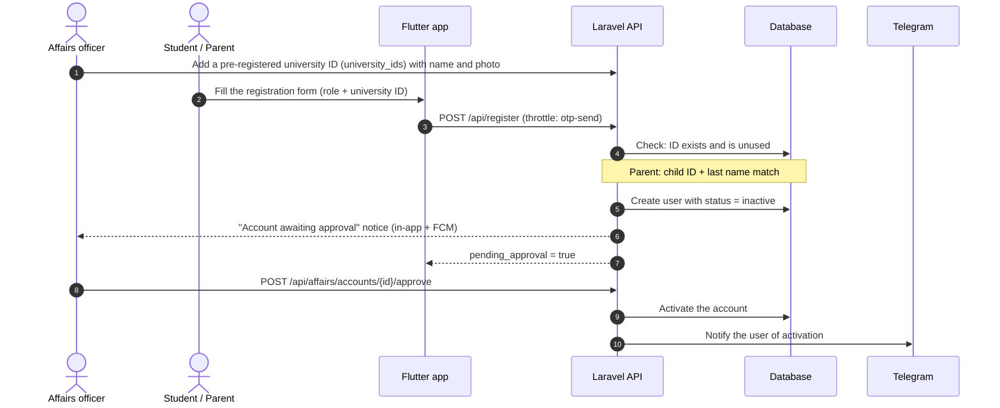
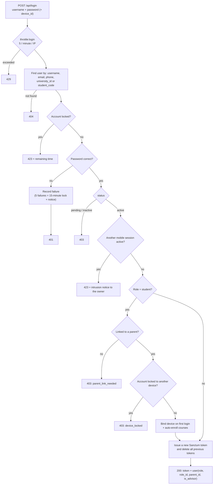
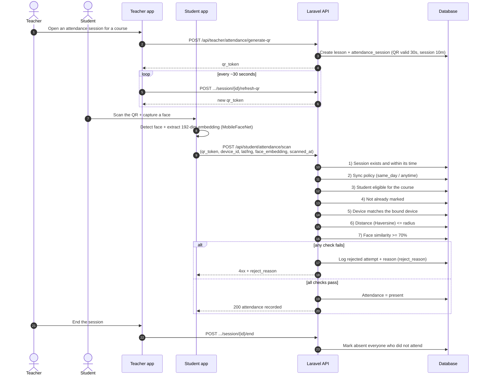
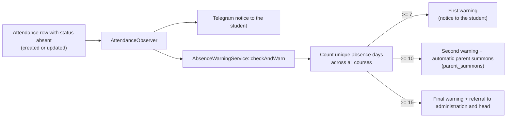
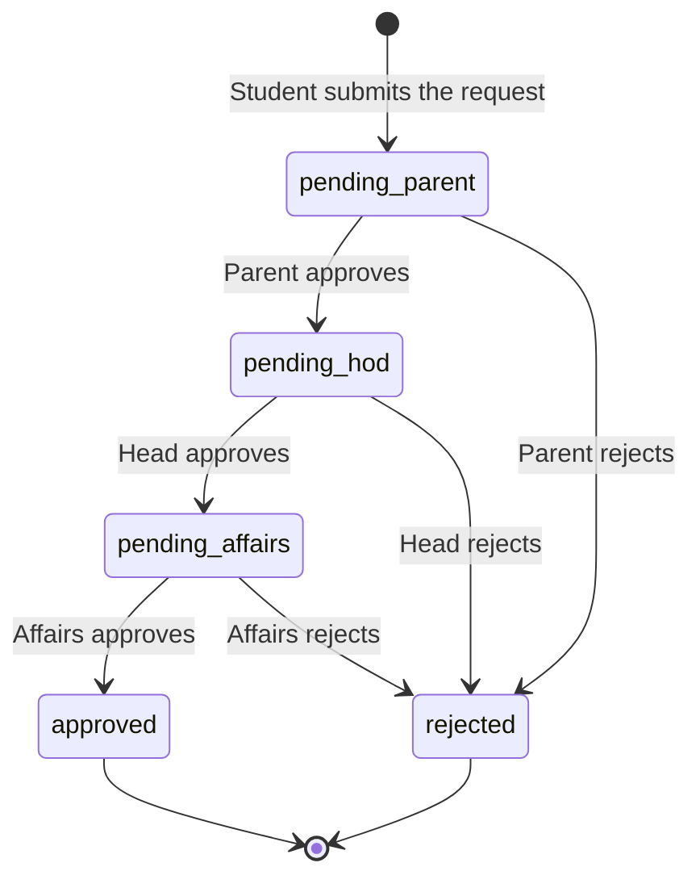
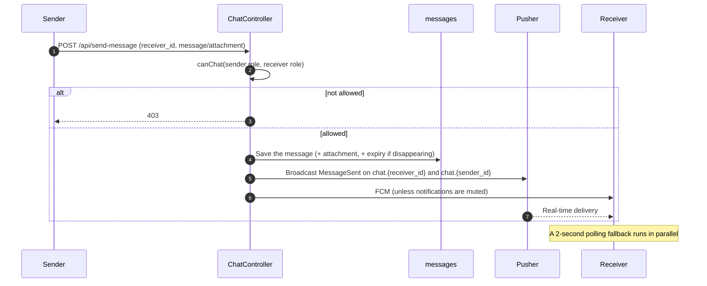
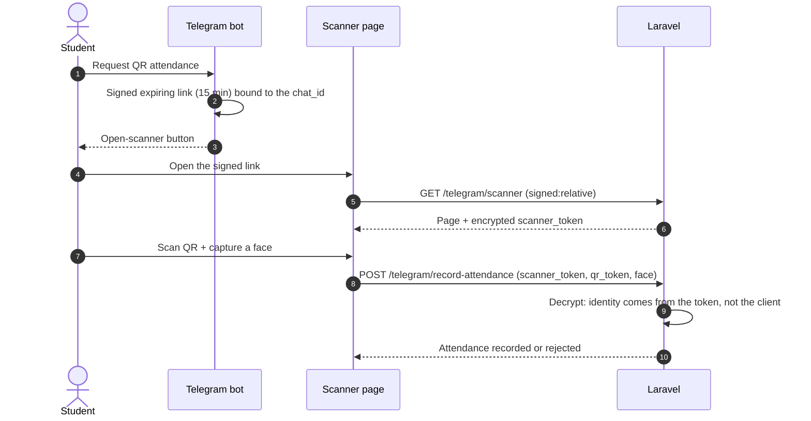

# Key Flows

Diagrams use Mermaid (rendered automatically on GitHub and the documentation site). Every flow is based on the real code; the source file is named.

## 1) Account creation and activation

Self-registered student and parent accounts go through Affairs review. (Source: `Api\AuthController::register`, `AffairsController::approveAccount`)

## 2) Login (API)

(Source: `Api\AuthController::login`, `SingleSessionGuard`, `LoginThrottleGuard`)

Alternatives: **email OTP login** (`/login-otp/send` then `/login-otp/verify`); the web has one login page per role, plus **face verification** for students signing in from multiple devices.

## 3) Attendance (QR + device + location + face)

(Source: `Api\TeacherController::generateQrSession` and `Api\StudentController::scanAttendanceQr`)

Reject reasons (`reject_reason`): `expired_qr`, `sync_timeout`, `lesson_not_found`, `device_mismatch`, `location_too_far`, `face_mismatch`, plus eligibility and duplicate reasons.

## 4) Automatic absence warnings

(Source: `AttendanceObserver`, `Services\AbsenceWarningService`)

Each level is issued **once** per student (`student_warnings`). See note B-07 in the project status.

## 5) Leave request

(Source: `StudentController::requestAbsence` -> `StudentParentController::respondLeaveRequest` -> `Api\DepartmentHeadController::respondLeaveRequest` -> `AffairsController::updateLeaveStatus`)

> All leave requests live in `leave_requests` and run through one workflow (`LeaveWorkflow`) for the web, the Flutter app and the bot. The old `absence_requests` table was copied into it and dropped.

## 6) Chat

Who can message whom:

| Sender | Can message |
|---|---|
| Student | Head of department, teacher, admin |
| Teacher | Teachers, students, head of department |
| Parent | Admin, head of department |
| Head of department | Parent, teacher, student, admin |
| Admin | Head of department, Affairs, teacher, student |
| Affairs | Admin |

## 7) Password recovery

- **API:** `forgot-password` sends an OTP, then `reset-password` (email + code + new password).
- **Web:** through Telegram: `send-otp` -> `verify-otp` (5 attempts maximum) -> `reset`; the code is kept in the browser session and is valid for 15 minutes.

## 8) Telegram scanner

(Source: `TelegramBotHandler::handleQrAttendanceMenu`, `TelegramWebhookController`)

Statuses: `verified` for a face match of 70% or more, `first_time` for the first embedding, `suspicious` when face data is missing or the match is weak (the teacher is alerted). Face can be made mandatory with `ATTENDANCE_REQUIRE_FACE=true`.
